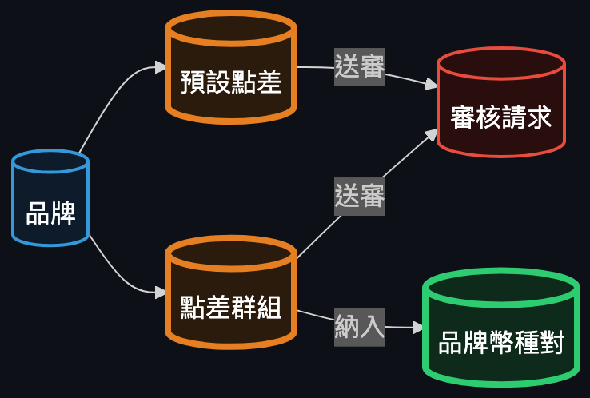
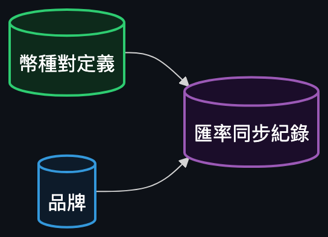
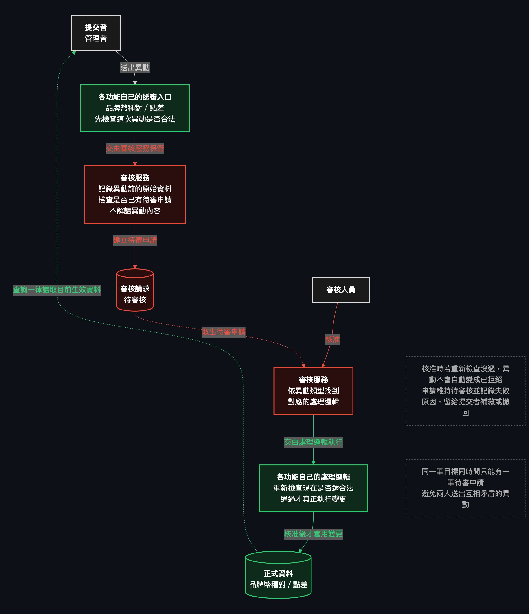

# wdd

## Structure

```
wdd/
├── .claude/            ← agents, commands, skills (git submodule)
├── develop/
│   ├── backend/        ← Spring Boot Maven project
│   └── frontend/       ← React Vite project
├── docker/             ← docker-compose.yml
├── demo/               ← static UI prototypes (node demo/server.js, port 8099)
├── docs/
│   ├── backend/        ← per-topic API docs (docs/backend/<slug>.md)
│   ├── blueprint/      ← unified architecture blueprint (embedded below)
│   ├── db/             ← ER model
│   └── frontend/       ← screen storyboards per flow
├── specs/              ← feature specs (dba/backend/frontend), the source of truth
├── AGENTS.md           ← agent-facing project notes
└── env.md              ← declared stack + container config
```

## Commands

Project lifecycle:
- `/init` — bootstrap `develop/`, `docker/` from `env.md` on an empty checkout
- `/spec <requirement>` — turn a requirement into frontend/backend/dba spec files, then chain into whichever doc command(s) the change actually alters
- `/dev` — execute every pending spec, dispatching to the matching agent (dba → backend → frontend)
- `/infra` — inspect/edit `env.md` and the matching `docker-compose.yml` service; the only place that starts a container service
- `/start` — start containers, then backend/frontend dev servers, in that order
- `/close` — the inverse of `/start`: stop backend/frontend and containers without deleting anything
- `/destroy` — the inverse of `/init`: wipe `develop/`, `docker/`, and every container, and reset all specs back to pending
- `/reset-env` — drop every table in the database and rebuild it from `specs/dba/`

Documentation (usually chained automatically by `/spec`, but runnable standalone):
- `/doc-backend [slug]` — per-topic backend API docs → `docs/backend/<slug>.md`
- `/doc-blue-print` — the unified architecture blueprint → `docs/blueprint/backend.md`
- `/doc-db` — the DB ER model → `docs/db/er-model.md`
- `/doc-fronend [group]` — real-looking screen storyboards → `docs/frontend/<group>/`

Git:
- `/commit [main|claude]` — commit and push this repo and/or the `.claude` submodule
- `/pull [main|claude]` — pull the latest changes for this repo and/or the `.claude` submodule
- `/reset [ref]` — discard all local changes (`git reset --hard` + `git clean -fd`)

Other:
- `/demo` — dispatch rapid, disposable UI prototyping (static HTML/CSS/JS, no framework) to a design subagent
- `/grunt` — a strict roleplay mode where every message is treated as a direct order, executed without question

A fresh checkout is: `/init` → `/dev`. Config and tooling shared across sessions live in the `.claude/` submodule (agents, commands, skills).

## 匯率中心後端系統藍圖

本文件整合以下 7 份後端 spec：品牌（brand）、幣種（currency）、幣種對定義（currency-pair-definition）、品牌幣種對（currency-pair）、點差（spread）、匯率同步（exchange-rate）、審核（audit）。這些 spec 個別描述的是各自的 API 細節；本文件要呈現的是把它們疊起來之後，**整個匯率中心現在實際運作的樣子**：品牌與幣種是底層主檔，幣種對定義建立「支援哪些幣種對」的全域規格並自動幫每個品牌鋪好一份設定，品牌幣種對是每個品牌真正在調整的東西（匯率來源、是否啟用、點差歸屬），點差系統決定這些幣種對最終加點多少，匯率同步則是把外部市場匯率、依當下點差算好，定期把當下的匯率記錄下來成為不再變動的歷史紀錄。品牌幣種對與點差的每一筆異動都必須經過同一套通用審核機制核准後才會生效，其餘資料則是提交即生效。

### 全景關係圖


這張圖是整份文件的目錄：藍色是主檔（品牌、幣種），淺綠是支援用的幣種對定義，深綠（粗框）是系統真正的核心——品牌幣種對，橘色（粗框）是同樣核心的點差設定（預設點差／點差群組），紫色是匯率同步留下的歷史紀錄，紅色是通用的審核請求儲存區。粗框的兩塊（品牌幣種對、點差設定）就是業務規則最密集、最常被審核擋下的地方；其餘都是餵養它們的主檔或基礎設施。

各實體自己的操作流程、參與角色與審核路徑，刻意沒有畫進這張圖——那些在下面各章自己的詳細圖裡。

### 各實體 / 資料儲存區

#### 品牌 (Brand)


*（節錄自完整架構圖）*

品牌是整個系統的擁有範圍根本，所有幣種對設定、點差設定、匯率紀錄都以品牌為單位區分。系統內建 7 個品牌（au、moneta、pug、star、um、vjp、vt），只能由管理者開啟或關閉，沒有新增／刪除入口，代碼與名稱一經建立即不可更動。變更啟用狀態立即生效，不經過審核，也不會觸發任何連鎖效應——但它是幣種對定義自動建立設定時的目標、點差系統的擁有者、也是匯率紀錄的維度之一。因為它自己只是單表維護、對其他實體沒有串接規則，依規則不另外畫詳細圖。

詳細欄位、規則與 API 定義 → [docs/backend/brand.md](docs/backend/brand.md)

#### 幣種 (Currency)


*（節錄自完整架構圖）*

幣種是幣種對定義的基礎資料，記錄代碼、名稱、符號與小數位數，供建立幣種對時的基準幣／報價幣參照使用。提供完整的新增、查詢、修改、刪除，代碼一經建立即不可修改，其餘欄位可自由更新，所有變更皆立即套用、不經過審核。幣種本身不主動連動其他資料，是否能被刪除、是否被幣種對定義引用等規則屬於幣種對定義那一端管控。同樣是純粹單表維護，不另外畫詳細圖。

詳細欄位、規則與 API 定義 → [docs/backend/currency.md](docs/backend/currency.md)

#### 幣種對定義 (CurrencyPairDefinition)


*（節錄自完整架構圖）*

幣種對定義是「這個系統支援哪些幣種對（例如 USD/JPY）」的全域主檔，決定基準幣、報價幣與換算精度，不分品牌、也沒有啟用／停用狀態。它的特殊之處在於：新增一筆定義時，系統會自動為當下每一個品牌各建立一筆品牌幣種對（預設停用、自動匯率），讓每個品牌一開始就有對應設定可調整，且這個建立動作不經過審核（因為它是定義本身動作的結果，不是使用者對品牌幣種對的直接操作）；而刪除一筆定義前，必須先確認底下每個品牌的幣種對都已停用，否則會被拒絕並列出仍啟用中的品牌代碼。


詳細欄位、規則與 API 定義 → [docs/backend/currency-pair-definition.md](docs/backend/currency-pair-definition.md)

#### 品牌幣種對 (CurrencyPair)


*（節錄自完整架構圖）*

品牌幣種對是每個品牌自己對某個幣種對的實際設定——匯率來源是自動（引用同步匯率）或手動（自行輸入，受定義精度限制）、是否啟用、以及是否被納入某個點差群組。這是整個系統業務規則最密集的實體：每一筆新增、修改、刪除都不會立即生效，而是送出一筆待審核申請，只有經審核人員核准後才會真正套用；查詢不受影響，永遠回傳目前生效的資料，且同一筆最多只能有一個待審申請。每一筆讀取還會即時算出「入金／出金加點完成匯率」——用這筆幣種對目前生效的點差（群組的或品牌預設的）乘上基礎匯率現算出來。唯一的例外是幣種對定義建立時的自動建立、與刪除時的連動刪除，這兩者直接寫入、不經審核。


詳細欄位、規則與 API 定義 → [docs/backend/currency-pair.md](docs/backend/currency-pair.md)

#### 點差設定：預設點差與點差群組 (BrandSpread / SpreadGroup)



*（節錄自完整架構圖）*

每個品牌都有一筆唯一的預設點差（入金／出金各一個百分比），另外可以建立任意數量的具名點差群組，各自擁有自己的入金／出金百分比。一筆品牌幣種對最多只能加入一個群組；有加入群組的用群組的點差，沒有的則套用品牌預設點差——這個「群組優先、否則預設」的解析規則同時被品牌幣種對的即時加點匯率、以及匯率同步時的計算重複使用。點差以百分比乘法套用在基礎匯率上（不是加法固定金額），且不得超過 100%。這裡的每一筆寫入——調整預設點差、新增／修改／刪除群組、把幣種對加入或移出群組——都要送審後才生效；「加入／移出群組」本質上也是改變品牌幣種對的計價方式，因此走同一套審核流程。


詳細欄位、規則與 API 定義 → [docs/backend/spread.md](docs/backend/spread.md)

#### 匯率同步紀錄 (ExchangeRate)



*（節錄自完整架構圖）*

這是系統向外部匯率來源同步市場匯率後留下的歷史紀錄，每次同步會對「每個幣種對定義 × 每個品牌」各記錄一筆原始匯率，以及套用該品牌當下生效點差算出的入金／出金匯率，並以分鐘為單位去重（一分鐘內不可重複呼叫外部來源）。這筆資料是凍結的歷史——同步當下算好就存下來，之後即使品牌的點差設定改變，已寫入的舊紀錄也不會被重新計算，這點與品牌幣種對永遠即時現算的加點匯率不同。同步是系統動作，直接寫入，不經過審核流程。


詳細欄位、規則與 API 定義 → [docs/backend/exchange-rate.md](docs/backend/exchange-rate.md)

### 通用模組：審核請求 (AuditRequest)

審核模組是一個對「品牌幣種對」與「點差」完全無知的通用機制。任何要送審的異動，呼叫的都是同一組通用動作：先記一筆「這是什麼類型的異動、要改哪一筆、改之前長怎樣、改之後要變成怎樣」（這些對這個模組而言都只是原樣存放的資料，它不解讀內容），狀態設為待審核。審核人員核准或駁回時，模組會依異動類型找到對應實體自己註冊的處理邏輯，執行兩件事：先「重新檢查這筆異動現在是否還合法」（因為送審之後，資料可能已經飄移，例如幣種對定義的精度被調緊了），通過才「真正執行變更」；若重新檢查沒過，異動不會被自動判定為駁回，而是維持待審核並記錄失敗原因，讓提交者可以之後補救或撤回。同一筆目標同時間只能有一筆待審申請，避免兩個人排隊送出互相矛盾的異動。目前這個系統沒有身分驗證，提交者／審核者只是呼叫端自己聲明的字串，僅供顯示與追蹤，不是安全機制，也不阻止同一人自己核准自己送的申請。



詳細欄位、規則與 API 定義 → [docs/backend/audit.md](docs/backend/audit.md)

### End-to-End 情境走查

**建立幣種對定義時的自動鋪底**：管理者新增一筆幣種對定義（例如 USD/JPY），系統在同一個動作裡就把目前存在的每個品牌都建立好一筆對應的品牌幣種對（停用、自動匯率）。這個自動建立直接寫入，不會產生任何待審核申請——因為這是定義本身動作的結果，不是使用者對某個品牌幣種對的操作；如果也要求審核，建立一筆定義就永遠無法真正完成。

**刪除幣種對定義前的守門**：管理者想刪除一筆已不再需要的定義，系統會先檢查它底下每個品牌的幣種對是否都已停用。只要還有任何一個品牌的對應幣種對是啟用中，刪除就會被拒絕，並回報還有哪些品牌代碼仍啟用，什麼都不會被刪除；只有全部停用之後，刪除定義才會連動刪掉底下所有品牌幣種對。

**品牌幣種對送審後，核准時才發現資料已經飄移**：管理者對某個手動匯率的幣種對送出修改申請（例如把匯率改成小數兩位），申請進入待審核。在審核人員核准之前，如果這筆定義的精度被另一個管理者調緊到只剩一位小數，審核人員核准時系統會重新驗證這筆待審申請，發現已經不合法而拒絕套用——但申請不會自動變成「已拒絕」，而是維持待審核並附上失敗原因，留給提交者或審核人員後續處理（重新提交合法的值，或直接取消）。

**幣種對加入點差群組：一對一限制與整批全有全無**：管理者想把幾筆品牌幣種對一次拉進某個點差群組，系統會先驗證整批——每筆是否存在、是否屬於同一品牌、有沒有哪一筆已經在別的群組裡。只要整批裡有任何一筆不合法（尤其是已經屬於別的群組——每個品牌幣種對最多只能屬於一個群組），整批都不會被送出待審；要把一筆幣種對換到另一個群組，必須先把它從目前的群組移出，才能加入新的。

**匯率同步：依當下點差記錄下來，事後改點差不會回頭改寫歷史**：一次同步呼叫會對系統裡每個幣種對定義各去外部市場來源取一次原始匯率，然後對每一個品牌，用那個品牌「當下」生效的點差（群組的或預設的，跟品牌幣種對即時加點用的是同一套判斷規則）算出入金／出金匯率，一起存成這一分鐘的紀錄。這筆紀錄從此固定不變——之後如果品牌調整了點差設定，並不會回頭修改已經寫入的舊紀錄，只有下一次同步才會用新的點差算出新的一筆。這也是它與品牌幣種對「每次讀取都用當下點差現算」的關鍵差異。

### 延伸閱讀

| 章節 | 對應 backend 詳細文件 |
|---|---|
| 品牌 | [docs/backend/brand.md](docs/backend/brand.md) |
| 幣種 | [docs/backend/currency.md](docs/backend/currency.md) |
| 幣種對定義 | [docs/backend/currency-pair-definition.md](docs/backend/currency-pair-definition.md) |
| 品牌幣種對 | [docs/backend/currency-pair.md](docs/backend/currency-pair.md) |
| 點差設定（預設點差／點差群組） | [docs/backend/spread.md](docs/backend/spread.md) |
| 匯率同步紀錄 | [docs/backend/exchange-rate.md](docs/backend/exchange-rate.md) |
| 審核請求（通用模組） | [docs/backend/audit.md](docs/backend/audit.md) |
