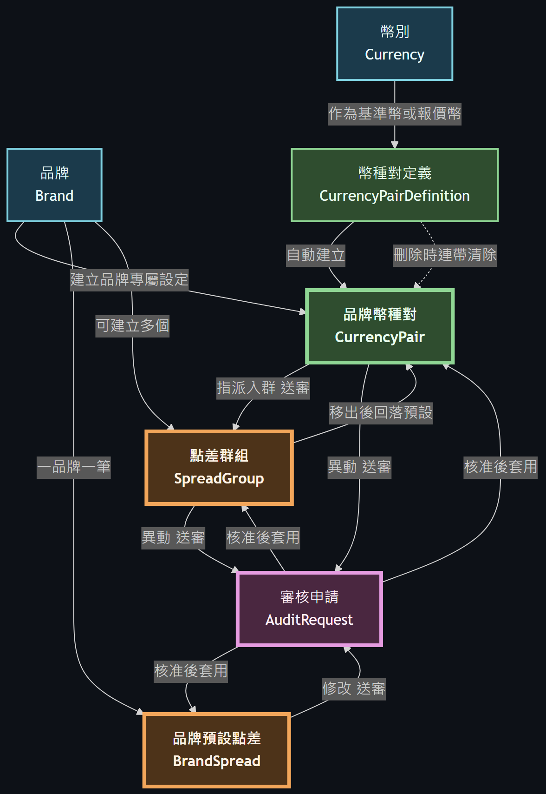
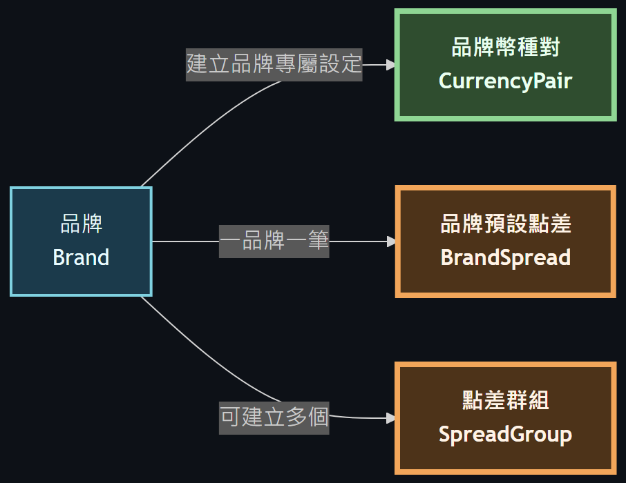
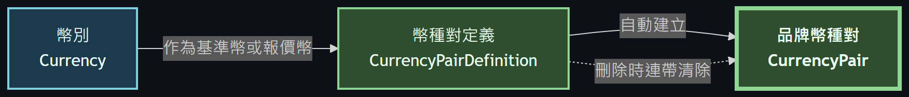
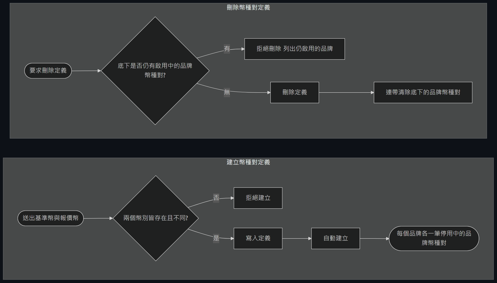
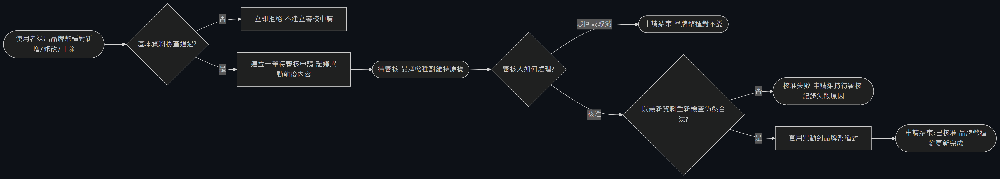
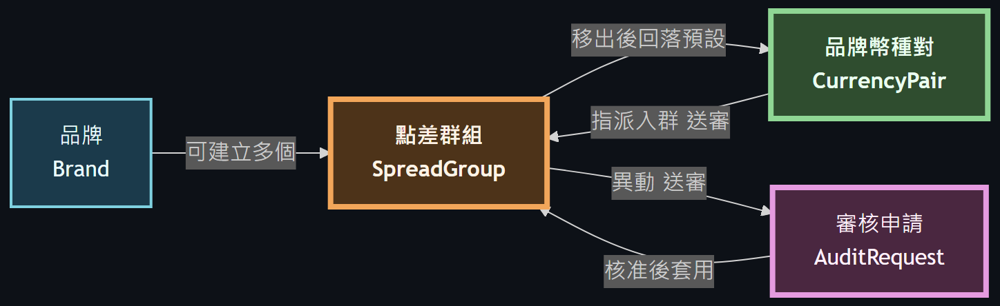
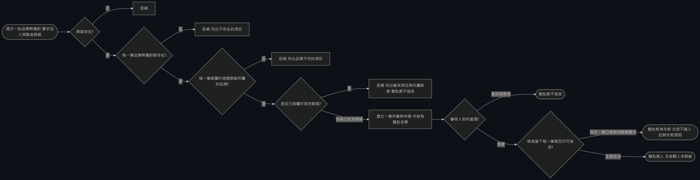
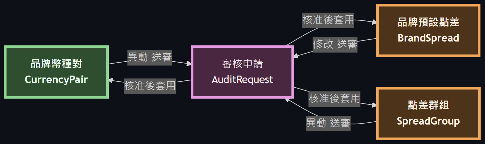
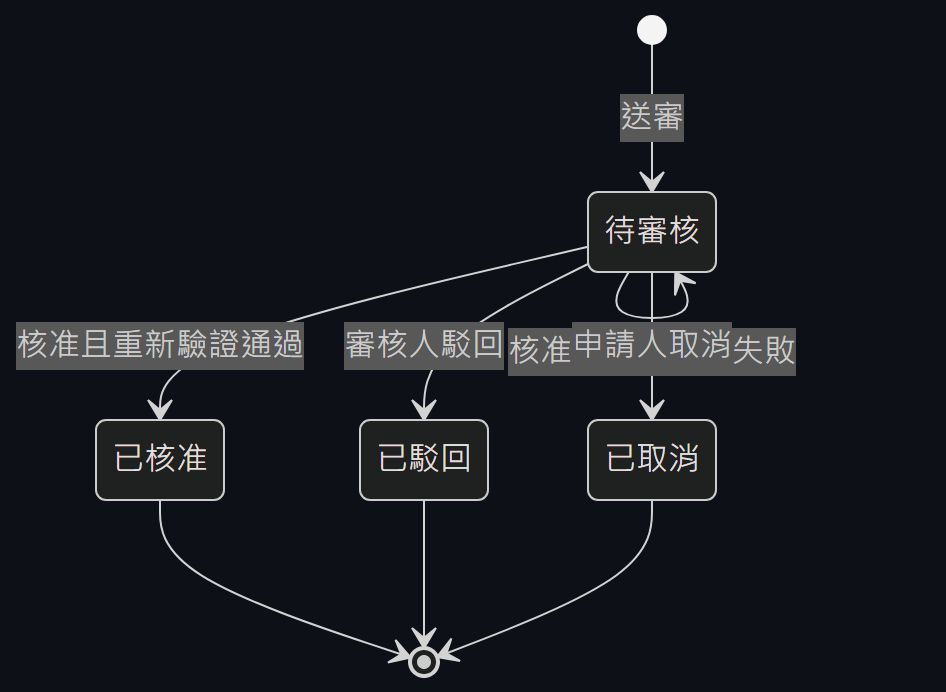

# 匯率中心後端系統整合藍圖

## 目的說明

這份文件整合了品牌（`specs/backend/brand.md`）、幣別（`specs/backend/currency.md`）、幣種對定義（`specs/backend/currency-pair-definition.md`）、品牌幣種對（`specs/backend/currency-pair.md`）、點差（`specs/backend/spread.md`，含品牌預設點差與點差群組）、審核（`specs/backend/audit.md`）六份規格，把它們當成同一個系統來解讀彼此的關係。

系統現在的樣子是：品牌與幣別是兩份不會被使用者新增/刪除的主檔；幣種對定義把兩個幣別組成一組交易標的，建立時會自動替每個品牌各生出一筆專屬設定（品牌幣種對）；品牌幣種對可以設定自動或手動匯率、可以開關、也可以被納入某個點差群組；點差分為「品牌預設點差」與「點差群組」兩層，沒有被分進群組的品牌幣種對就套用品牌的預設點差。**目前系統最關鍵的一條規則是：品牌幣種對與點差（不論預設或群組）的任何新增、修改、刪除，都不會立刻生效，而是先變成一筆待審核申請，必須經過審核人核准後才會真的套用到資料上。** 幣種對定義本身的建立、修改、刪除則不受此規則約束，維持送出即生效。

---

## 完整架構圖

---

## 每個 Entity / Data Store 說明

### 3.1 品牌 Brand

*（節錄自完整架構圖）*

品牌是整個系統的擁有者根節點，目前固定七個（au、moneta、pug、star、um、vjp、vt），只能查詢與開關啟用狀態，不能透過 API 新增或刪除。每個品牌各自擁有一組品牌幣種對、一筆品牌預設點差、以及可自建的多個點差群組——圖中所有品牌專屬設定都是從這個節點「長出來」的。品牌本身的開關屬於直接生效的操作，不經過審核流程。

詳細欄位、規則與 API 定義 → docs/backend/brand.md

### 3.2 幣別 Currency

*（節錄自完整架構圖）*

幣別是一份可由使用者自由新增、查詢、修改、刪除的主檔（例如 USD、JPY），代碼一旦建立即不可更改。它的角色單純：被幣種對定義引用，作為某組交易標的的基準幣或報價幣。幣別本身的變動不會觸發任何連帶效果，也不經過審核流程。

詳細欄位、規則與 API 定義 → docs/backend/currency.md

### 3.3 幣種對定義 CurrencyPairDefinition

*（節錄自完整架構圖）*

幣種對定義把兩個幣別（基準幣／報價幣）組成一組交易標的，並設定小數精度。它是品牌幣種對的「模板」：建立一筆定義時，系統會自動替目前每一個品牌各建立一筆對應的品牌幣種對（預設停用、自動匯率）；刪除一筆定義時，如果底下還有任何品牌的品牌幣種對處於啟用狀態就會被擋下，只有全部停用後才能刪除，刪除當下會把它名下所有的品牌幣種對一併清除。這個建立與刪除都是直接生效，不經過審核——因為它是「定義」本身的動作，不是對某個品牌幣種對的操作。

詳細欄位、規則與 API 定義 → docs/backend/currency-pair-definition.md

### 3.4 品牌幣種對 CurrencyPair

*（節錄自完整架構圖）*

品牌幣種對是整個系統的核心業務物件：某個品牌對某個幣種對定義的實際交易設定，決定要用自動匯率還是手動填入的匯率、要不要啟用、要不要納入某個點差群組。多數品牌幣種對是幣種對定義建立時自動生出來的，但這支 API 也允許單獨新增或刪除某一筆（例如把被刪掉的那筆補回來）。**它的新增、修改、刪除全部改為送審制**：呼叫端先做一次基本資料檢查（幣種對定義／品牌是否存在、手動匯率的小數位是否超過定義允許的精度、同一筆是否已有待審申請），檢查通過才會建立一筆待審核申請，資料本身在核准之前完全不變；核准時系統會拿當下最新的資料重新檢查一次規則是否還成立，通過才真正套用。是否被分進點差群組（`spreadGroupId`）只能透過點差群組的成員異動端點改變，品牌幣種對自己的新增／修改端點就算帶了這個欄位也會被忽略。

詳細欄位、規則與 API 定義 → docs/backend/currency-pair.md

### 3.5 品牌預設點差 BrandSpread

*（節錄自完整架構圖）*

品牌預設點差是每個品牌固定的一筆點差設定（入金點差、出金點差），不會被新增也不會被刪除，只能修改。它是點差解析的「地板」——任何一筆沒有被分進點差群組的品牌幣種對，最終套用的就是它所屬品牌的這筆預設點差。它的修改同樣改為送審制：呼叫端送出的新數值先通過基本驗證（不可為負、小數位不超過 8 位），才會變成待審核申請，資料要等核准後才真正更新。

詳細欄位、規則與 API 定義 → docs/backend/spread.md

### 3.6 點差群組 SpreadGroup

*（節錄自完整架構圖）*

點差群組是品牌自建的第二層點差設定，一個品牌可以有多個群組，每個群組有自己的入金／出金點差，並可以把該品牌名下的品牌幣種對「拉進來」共用這組點差。核心限制是**一個品牌幣種對同時只能屬於一個群組**——要換組必須先移出目前的群組。群組本身的新增、修改、刪除，以及把品牌幣種對加入／移出群組，全部都是送審制的操作；群組被刪除核准後，原本的成員不會被砍掉，只是它們的群組欄位被清空，自動回落到品牌預設點差。加入群組的申請是整批送審、整批核准或整批失敗，不會只套用一部分。

詳細欄位、規則與 API 定義 → docs/backend/spread.md

---

## 通用／可重用模組：審核 AuditRequest

*（節錄自完整架構圖）*

審核模組是一個完全通用的申請流程引擎，被品牌幣種對、品牌預設點差、點差群組三種業務物件共用。它的設計原則是**對業務一無所知**：它不認得幣種對、不認得點差，也從不解讀「異動前的內容」和「異動後的內容」這兩包資料的意義——這些對它來說只是不透明的紀錄。所有跟特定物件相關的知識（怎麼判斷這筆申請現在還合不合法、核准後要怎麼真的寫入資料）都寫在該物件自己註冊的「處理器」裡，審核模組只負責：

- 接收送審申請，確認同一個目標（例如同一筆品牌幣種對、同一個品牌的預設點差、同一個點差群組）沒有其他待審申請卡著，否則拒絕；
- 提供查詢、核准、駁回、取消四個操作，狀態只能從「待審核」轉為「已核准」「已駁回」「已取消」其中之一，且一旦離開待審核就不能再變動；
- 核准時呼叫對應處理器「重新檢查是否仍合法」再「真的套用」，兩件事跟狀態更新綁在同一次交易裡——只要重新檢查沒通過，申請會維持在待審核並記下失敗原因，不會自動變成駁回，因為「資料過時」不等於「審核人決定不通過」。

必須誠實說明一件事：**這個專案目前沒有任何登入或身分驗證機制**。每一次呼叫都可以自己在標頭裡填一個「操作人」字串，這個欄位只是用來顯示與留存紀錄，並不是身分證明。因此系統目前**無法防止同一個人自己送審又自己核准**——要做到「送審人與核准人必須不同」，前提是要先有真正的登入機制，這是現況的已知限制，不是這份文件遺漏。

詳細欄位、規則與 API 定義 → docs/backend/audit.md

---

## End-to-End 情境走查

**情境一：建立一筆幣種對定義，自動生出七筆品牌幣種對。** 使用者建立一筆「USD/JPY」的幣種對定義後，系統會立刻（不經審核）替每一個現有品牌各建立一筆對應的品牌幣種對，初始狀態是停用、自動匯率、沒有加入任何點差群組。這條路徑之所以不送審，是因為它是「建立定義」這個動作的連帶結果，不是使用者對某一筆品牌幣種對主動下的指令；如果連這個自動生成的動作都要送審，定義本身就永遠無法一次建立完成。

**情境二：修改一筆品牌幣種對，送審後核准才生效。** 使用者把某品牌的 USD/JPY 從自動匯率改成手動匯率並填入數值，系統先確認幣種對定義存在、小數位沒有超過定義允許的精度、這筆資料目前沒有其他待審申請，通過後建立一筆待審核申請——這筆品牌幣種對此時的匯率設定完全沒有改變。之後審核人核准，系統會拿當下最新的定義精度再驗一次，確認仍然合法才真的把匯率寫進去；如果審核人駁回或申請人自己取消，資料同樣維持原樣。

**情境三：核准當下資料已經變動，導致套用失敗。** 承情境二，如果在申請待審期間，有人把該幣種對定義的精度從 4 位改窄成 2 位，而申請裡的手動匯率是 3 位小數，審核人核准時系統重新檢查就會發現這筆申請已經不合法——這次核准會失敗，申請**不會**自動被判定駁回，而是繼續停留在待審核狀態並記下失敗原因，等相關人員處理（例如撤回申請重新送一次，或等精度改回來再重試核准）。

**情境四：刪除一個點差群組，核准後成員回落預設點差。** 使用者對某個有成員的點差群組送出刪除申請，審核人核准後，這個群組被真正刪除，但原本掛在裡面的每一筆品牌幣種對**不會被連帶刪除**，只是它們的群組欄位被清空，之後這些品牌幣種對就自動改套用該品牌的預設點差。

**情境五：同一筆資料同時只能有一筆待審申請。** 如果某一筆品牌幣種對已經有一筆待審核的修改申請，此時另一個人想針對同一筆再送一次修改或刪除，系統會直接擋下，因為同一個目標同時只允許一筆待審申請存在，避免兩筆互相矛盾的異動同時排隊；要送出新的申請，必須先讓前一筆走完流程（核准、駁回，或申請人自己取消）。

---

## 延伸閱讀

| 章節 | 對應 backend 詳細文件 |
|---|---|
| 3.1 品牌 Brand | docs/backend/brand.md |
| 3.2 幣別 Currency | docs/backend/currency.md |
| 3.3 幣種對定義 CurrencyPairDefinition | docs/backend/currency-pair-definition.md |
| 3.4 品牌幣種對 CurrencyPair | docs/backend/currency-pair.md |
| 3.5 品牌預設點差 BrandSpread | docs/backend/spread.md |
| 3.6 點差群組 SpreadGroup | docs/backend/spread.md |
| 審核 AuditRequest | docs/backend/audit.md |
