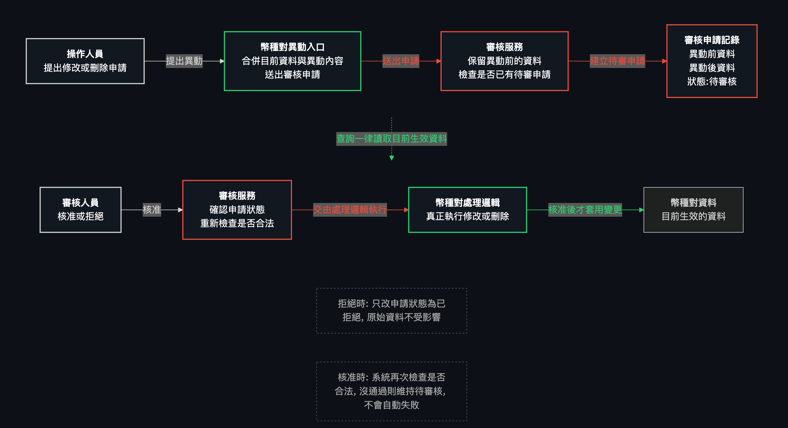
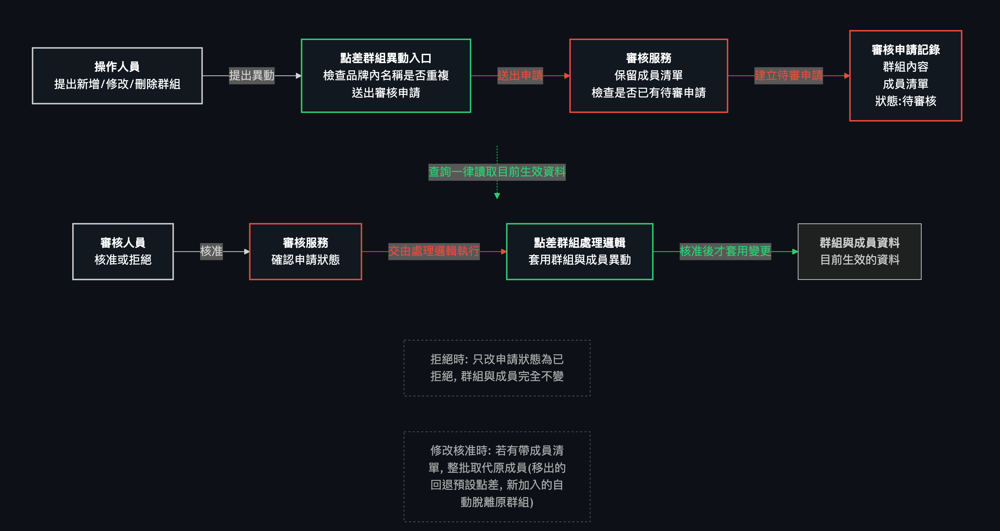
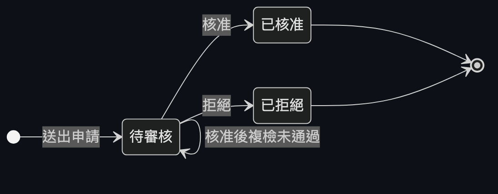

# 整合技術說明文件：品牌 / 幣種 / 幣種對 / 點差 / 審核系統

## 1. 文件目的與範圍

本文件整合了以下 7 份後端規格文件，把它們當作**同一個系統**來說明，而不是逐一介紹每份規格：

- `specs/backend/brand.md`（品牌）
- `specs/backend/currency.md`（幣種）
- `specs/backend/currency-pair-definition.md`（全域幣種對定義）
- `specs/backend/currency-pair.md`（品牌幣種對）
- `specs/backend/currency-pair-approval.md`（品牌幣種對的審核串接）
- `specs/backend/spread.md`（預設點差 / 客製點差群組）
- `specs/backend/audit.md`（通用審核模組）

整合後，這個系統目前的樣子是：**品牌與幣種是兩份基礎資料；幣種對必須先建立「全域定義」，系統才會自動幫每個品牌各生一筆自己的幣種對；幣種對本身的新增沒有獨立入口、修改/刪除都必須送審核准才會生效；每個品牌都有一筆預設點差，也可以額外建立客製點差群組把多個幣種對綁在一起共用同一組點差；點差群組的新增/修改/刪除同樣要送審；而「送審→核准/拒絕」這整套流程，是由一個完全不認識任何業務資料的通用審核模組負責，各業務功能只是分別插上去而已。**

---

## 2. 完整架構圖

**圖中重點說明**：
- 品牌建立時，系統會自動幫它產生一筆預設點差，兩者是一對一的關係。
- 幣種對定義建立時，會自動幫「每一個品牌」各產生一筆屬於該品牌的幣種對（鋪貨），已經存在的品牌資料不會被覆蓋；幣種對定義刪除前，也要反過來檢查每個品牌的幣種對是否都已停用。
- 幣種本身的刪除，要先檢查是否還被任何品牌幣種對引用。
- 品牌幣種對、預設點差、客製點差群組這三種資料的異動（新增/修改/刪除，依各自規則而不同），一律要透過審核請求送審，核准後系統才會真正套用到資料本身。
- 點差群組底下的成員，各自對應一個品牌幣種對；沒有加入任何群組的幣種對，就使用它所屬品牌的預設點差。

---

## 3. 主要資料與業務規則

### 3.1 品牌（Brand）

品牌是系統最基礎的資料，目前固定為 7 個（AU、MONETA、PUG、STAR、UM、VJP、VT），全部由資料庫種子建立，不透過 API 新增或刪除。

| Field | Type/Role | Rule |
|---|---|---|
| id | 系統編號 | 自動產生 |
| code | 品牌代碼 | 建立時寫入，僅能透過資料庫種子產生，之後永久不可修改 |
| name | 品牌名稱 | 同上，永久不可修改 |
| active | 啟用狀態 | 唯一能透過 API 修改的欄位 |
| createdAt / updatedAt | 時間戳記 | 系統自動維護 |

**Constraints**
- 沒有新增、沒有刪除功能 —— 品牌永遠是那固定 7 個。
- `code`、`name` 一旦建立就不可再變更。
- 唯一可異動的操作是切換 `active`（啟用/停用），而且是**直接套用**，不需要送審。
- 查詢可依啟用狀態篩選。

---

### 3.2 幣種（Currency）

| Field | Type/Role | Rule |
|---|---|---|
| id | 系統編號 | 自動產生 |
| code | 幣種代碼（3 位大寫字母） | 建立時必填、唯一；**建立後永久不可修改**（此規則來自幣種對規格對幣種模組的覆蓋，修改時即使帶了這個欄位也會被忽略） |
| name | 幣種英文名稱 | 必填 |
| nameZh | 幣種中文名稱 | 選填 |
| symbol | 貨幣符號 | 選填 |
| decimalPlaces | 小數位數（0~8） | 必填 |
| createdAt / updatedAt | 時間戳記 | 系統自動維護 |

**Constraints**
- 目前**沒有啟用/停用的概念**，幣種只有「存在」或「被刪除」兩種狀態，沒有中間的停用狀態。
- 幣種代碼必須全系統唯一，重複建立會被拒絕。
- 幣種代碼一旦建立即不可修改。
- **刪除防呆**：刪除前會檢查這個幣種是否還被任何品牌幣種對當作正向或反向幣種使用，只要還在使用中就拒絕刪除，必須先處理掉相關的幣種對才能刪除。
- 新增/修改/刪除都是**直接套用**，不需要送審（審核只發生在幣種對本身）。

---

### 3.3 全域幣種對定義（Currency Pair Definition）

這是一個「幣種對主檔」概念：先建立一次（例如 USD/JPY），系統就會自動幫**每一個品牌**各產生一筆屬於它自己的幣種對。這個功能**直接套用**，不經過審核。

| Field | Type/Role | Rule |
|---|---|---|
| id | 系統編號 | 自動產生 |
| baseCurrencyId / baseCurrencyCode | 正向幣種 | 建立時必填且必須存在；**建立後不可修改** |
| quoteCurrencyId / quoteCurrencyCode | 反向幣種 | 同上；必須與正向幣種不同 |
| forwardPrecision | 正向精度（0~8） | 必填，之後可修改 |
| reversePrecision | 反向精度（0~8） | 必填，之後可修改 |
| createdAt / updatedAt | 時間戳記 | 系統自動維護 |

**Constraints**
- 同一個方向只能存在一筆定義；如果 USD→JPY 已經建立，無論再建立 USD→JPY（重複）或 JPY→USD（反向）都會被拒絕。
- 建立後，`baseCurrencyId`/`quoteCurrencyId` 永久不可修改，只能修改兩個精度欄位。
- 建立時會自動走訪目前所有品牌：某品牌若已經有這個方向的幣種對，就跳過不動（保留原資料）；沒有的話就自動新增一筆（匯率類型為系統自動、匯率留空、狀態為啟用）。
- **刪除只刪定義本身**，絕不會刪除或修改任何已經鋪貨出去的品牌幣種對——那些資料一旦產生就是各品牌自己獨立的一般資料。
- **刪除防呆**：只有當「所有品牌」對這個方向的幣種對都已經停用，才允許刪除；只要還有一個品牌是啟用中，就拒絕刪除，並附上還在啟用中的品牌清單讓使用者知道要先處理哪些品牌。品牌完全沒有這筆幣種對（例如被獨立刪除過）不會擋刪除，只有「啟用中」的資料才會擋。
- 定義刪除後，該方向的反向（例如原本被佔用的 JPY→USD）就可以重新建立新的定義。

---

### 3.4 品牌幣種對（Currency Pair）

每一筆幣種對都屬於「某一個品牌」，帶有匯率設定。這是唯一一個**新增管道完全被拿掉、修改/刪除一定要送審**的資料。

| Field | Type/Role | Rule |
|---|---|---|
| id | 系統編號 | 自動產生 |
| brandId / brandCode | 所屬品牌 | 必須存在 |
| baseCurrencyId / baseCurrencyCode | 正向幣種 | 必須存在，且與反向幣種不同 |
| quoteCurrencyId / quoteCurrencyCode | 反向幣種 | 同上 |
| rate | 匯率 | 可為空；規則見下方 |
| rateType | 匯率類型（人工填 / 系統自動） | 必填 |
| active | 啟用狀態 | 是否生效中 |
| createdAt / updatedAt | 時間戳記 | 系統自動維護 |

**Constraints**
- **沒有獨立的新增功能**——唯一產生方式是「全域幣種對定義」建立時的自動鋪貨；沒有任何管道（無論要不要送審）可以單獨幫某個品牌新增一筆幣種對。
- 查詢（讀取列表 / 單筆）一律直接讀取即時、已核准的資料，完全不受待審請求影響。
- **修改與刪除一律不會直接套用**，一定要送出審核請求，等審核人員核准後系統才真正異動資料；送出審核當下，即時資料完全不變。
- 同一筆幣種對如果已經有一筆待審中的請求，不能再送出第二筆（會被擋下來，須等前一筆處理完）。
- 匯率規則：匯率類型若為「人工填」，匯率必須大於 0；若為「系統自動」，匯率一律清空為空值，即使呼叫端在請求裡帶了匯率也會被忽略。
- 同一個品牌內，不能有重複的（正向幣種、反向幣種）組合。
- 同一組（正向、反向）在不同品牌下是允許各自存在的（本來就是設計上要讓每個品牌都有一份）。

---

### 3.5 預設點差（Spread Default）

每個品牌都有且只有一筆預設點差，當幣種對沒有加入任何客製點差群組時，就是用這一筆。

| Field | Type/Role | Rule |
|---|---|---|
| id | 系統編號 | 自動產生 |
| brandId / brandCode | 所屬品牌 | 一對一 |
| depositSpread | 入金點差 | 必填，需 ≥ 0 |
| withdrawSpread | 出金點差 | 必填，需 ≥ 0 |
| createdAt / updatedAt | 時間戳記 | 系統自動維護 |

**Constraints**
- 沒有新增、沒有刪除功能——每個品牌在被建立（種子）時就自動有一筆，永遠是一對一的關係。
- 唯一可異動的是入金/出金點差兩個數字，且**一定要送審**，核准後才會真正套用；送審期間即時資料不變。
- 同一筆若已有一筆待審中的請求，不能再送第二筆。
- 查詢是即時、直接讀取，不受待審請求影響。

---

### 3.6 客製點差群組（Spread Group）

一個品牌可以建立多個客製點差群組，把多個幣種對綁在一起共用同一組入金/出金點差。新增、修改、刪除全部都要送審。

| Field | Type/Role | Rule |
|---|---|---|
| id | 系統編號 | 自動產生 |
| brandId / brandCode | 所屬品牌 | 必填，必須存在 |
| name | 群組名稱 | 必填，同一品牌內不可重複，最長 100 字 |
| depositSpread | 入金點差 | 必填，需 ≥ 0 |
| withdrawSpread | 出金點差 | 必填，需 ≥ 0 |
| members | 成員清單（內嵌顯示） | 見下方成員小節 |
| createdAt / updatedAt | 時間戳記 | 系統自動維護 |

**Constraints**
- 新增、修改、刪除**全部都要送審**，核准後才真正生效；送審期間，即時的群組資料與成員關係完全不變。
- 名稱在同一品牌內必須唯一——不只要跟現有的群組比對，連另一筆還在待審中的「新增」請求用的名稱都要一起比對，避免兩筆同名的申請都通過。
- 修改時如果沒有帶成員清單，代表這次異動不動成員，維持送審當下的既有成員名單。
- 修改時如果帶了新的成員清單，核准後會用整份清單**整批取代**原本的成員：被移出的幣種對會回退用品牌預設點差；新加入的幣種對如果原本屬於別的群組，會自動被移出原群組、改加入這個群組（是「移動」，不是報錯）。
- 刪除群組核准後，這個群組本身連同它的所有成員關係一起消失，原本這些幣種對立即改用品牌預設點差。
- 系統刻意不處理「兩筆不同的待審請求搶同一個幣種對」的情況——晚被核准的那一筆會蓋掉先被核准的結果，由審核人員自己在核准前比對異動前後差異來避免衝突。

---

### 3.7 點差群組成員（Spread Group Member）

點差群組成員記錄「哪個幣種對現在屬於哪個群組」，本身沒有獨立的操作入口。

| Field | Type/Role | Rule |
|---|---|---|
| id | 系統編號 | 自動產生 |
| spreadGroupId | 所屬群組 | 必須存在 |
| currencyPairId | 對應的幣種對 | 必須存在，且必須跟群組同一個品牌 |
| baseCurrencyCode / quoteCurrencyCode | 唯讀顯示用 | 方便畫面直接顯示幣種對名稱 |
| createdAt | 時間戳記 | 系統自動維護 |

**Constraints**
- 一個幣種對**同時最多只能屬於一個群組**。
- 沒有獨立的「新增成員」「移除成員」API——成員名單完全跟著所屬 Spread Group 的建立/修改請求一起送審、一起核准生效。
- 加入群組的幣種對必須跟這個群組屬於同一個品牌，否則會被拒絕。

---

### 3.8 審核請求（Audit Request）

審核請求是整套「送審→待審中→核准/拒絕」流程唯一的資料落點，目前被品牌幣種對、預設點差、客製點差群組這三種業務資料共用。

| Field | Type/Role | Rule |
|---|---|---|
| id | 系統編號 | 自動產生 |
| entityType | 這筆請求屬於哪種業務資料（例如品牌幣種對、預設點差、點差群組） | 必填，由送審的業務模組自己指定 |
| actionType | 這次要做的動作（新增／修改／刪除） | 必填 |
| entityId | 對應的資料編號 | 新增時尚未有編號，先留空；核准後才會回填 |
| beforeSnapshot | 異動前保留的原始資料 | 修改/刪除時才有，新增時為空 |
| afterSnapshot | 異動後預計套用的資料 | 新增/修改時才有，刪除時為空 |
| summary | 給審核人員看的一句話摘要 | 由對應業務模組產生 |
| status | 狀態（待審中／已核准／已拒絕） | 系統維護 |
| requestedBy / requestedAt | 提出人與提出時間 | 提出人為自由文字，沒有登入系統可對應 |
| reviewedBy / reviewedAt / rejectReason | 審核人、審核時間、拒絕原因 | 核准/拒絕時填入 |
| createdAt / updatedAt | 時間戳記 | 系統自動維護 |

**Constraints**
- 同一個（業務資料類型、資料編號）**同時最多只能有一筆待審中的請求**；如果是「新增」類型（此時還沒有資料編號），改由各自業務模組自行檢查有沒有重複的待審新增申請。
- 只有「待審中」的請求可以被核准或拒絕；已經處理過的請求再核准/拒絕一次會被拒絕。
- 核准時，系統會**重新檢查一次規則**（因為送審之後資料可能已經變化了），如果沒通過，請求會**維持在待審中**，不會自動變成拒絕，讓人可以再次嘗試或改為手動拒絕。
- 拒絕不需要重新檢查規則，只需要填寫拒絕原因；原始資料完全不會被異動。
- 這個模組本身完全不認識「品牌幣種對」「點差群組」等任何具體業務概念——它只認得「某種類型的資料、某個編號」，實際的資料存取與規則全部交給各自的業務模組。

---

## 4. 通用／可重用模組：審核（Audit）機制的設計方式

審核模組被設計成**完全不認識任何具體業務資料**的通用元件。任何業務功能要「加上要審核才能生效」這個特性，只需要照著一份固定的合約提供 4 個方法，審核模組本身完全不用修改。這 4 個方法白話上分別是：

1. **「取得目前資料的方法」**：在要送出「修改」或「刪除」的審核請求之前，審核模組會先問對應的業務模組：「這筆資料現在的樣子是什麼？」，把結果存成「異動前的資料」。如果這筆資料根本不存在，業務模組會自己回報「找不到」的錯誤。

2. **「檢查是否可以執行的方法」**：在送出「新增」或「修改」的申請時，以及**核准的那一刻**，審核模組都會呼叫這個方法，讓業務模組自己檢查這筆提議的內容是否符合規則（例如名稱有沒有重複、金額是否合理、幣種是否存在）。不符合規則就會被擋下——送審時被擋就直接失敗；核准時被擋，請求會維持在待審中，不會被自動拒絕。

3. **「真正執行變更的方法」**：只有在審核人員**核准**的那一刻才會被呼叫，交由業務模組自己決定要新增、修改還是刪除實際資料，並回報這筆資料最終的編號（新增時是剛產生的新編號，修改/刪除則是原本的編號）。

4. **「產生摘要文字的方法」**：把這筆審核請求的內容轉換成一句給審核人員看的簡短說明（例如「品牌·幣種對」或「品牌·群組名稱」），方便在待審清單上快速辨識，不用展開細節就能大致知道這是什麼異動。

審核模組本身只做「誰在等審核」「核准/拒絕的狀態機」「同一筆資料同時只能有一筆待審中」這幾件通用的事，完全不會出現任何業務資料表的名稱或欄位邏輯——目前插進來使用這套機制的三個業務功能是：品牌幣種對（修改、刪除）、預設點差（修改）、點差群組（新增、修改、刪除）。

---

## 5. End-to-End 情境走查

**情境 A：建立一組新的全域幣種對，自動鋪貨到全部品牌**
1. 使用者呼叫建立幣種對定義，指定正向幣種 USD、反向幣種 JPY，並設定正向/反向精度。
2. 系統檢查兩個幣種都存在且不同，並確認這個方向（含反向）目前沒有其他定義存在。
3. 系統寫入這筆全域定義。
4. 系統讀取目前所有品牌，逐一檢查每個品牌是否已經有 USD/JPY 這組幣種對——已經有的品牌（例如某品牌先前已手動存在一筆）就跳過不動；沒有的品牌就自動新增一筆（匯率類型為系統自動、匯率留空、狀態啟用）。
5. 回應建立完成的定義；若要查看每個品牌實際被鋪貨的結果，需另外查詢幣種對清單。

**情境 B：修改品牌幣種對的匯率，需經過審核才會生效**
1. 操作人員送出修改某品牌幣種對的請求（例如改成人工填匯率、填入 32.5）。
2. 系統先確認這筆幣種對目前沒有其他待審中的請求。
3. 系統把「異動前的資料」與「提議的異動後資料」一起存成一筆待審中的審核請求，即時資料完全沒有被改動。
4. 審核人員查看這筆請求的異動前後差異。
5. 審核人員核准——系統重新檢查一次規則（例如匯率是否大於 0），通過後才真正把新匯率寫入該筆幣種對，請求狀態變成已核准。
6. 若重新檢查沒通過（例如同時間有其他已核准的異動造成組合重複），核准會失敗，請求維持待審中，不會自動變成拒絕。

**情境 C：全域幣種對定義的刪除守門機制**
1. 使用者嘗試刪除一筆全域幣種對定義（例如 USD/JPY）。
2. 系統檢查所有品牌目前這個方向的幣種對，只要還有任何一個品牌是啟用中，就拒絕刪除，並列出還在啟用中的品牌代碼。
3. 使用者透過品牌幣種對的修改流程（送審→核准），把每個品牌這筆幣種對停用。
4. 所有品牌都停用後，再次嘗試刪除該全域定義，這次成功——但已經鋪貨出去的品牌幣種對資料完全不受影響，只是這筆全域定義本身被移除。
5. 定義刪除後，原本被佔用的反向方向（JPY/USD）現在可以重新建立新的定義。

**情境 D：幣種刪除防呆**
1. 使用者嘗試刪除一個幣種（例如 USD）。
2. 系統檢查目前有沒有任何品牌幣種對（不論作為正向或反向）還在使用這個幣種。
3. 只要有任何幣種對引用它，刪除就會被拒絕，並提示這個幣種正被使用中。
4. 使用者必須先確保沒有任何幣種對使用這個幣種，才能成功刪除。

**情境 E：建立客製點差群組並移動幣種對**
1. 操作人員送出建立點差群組的請求，指定品牌、群組名稱、入金/出金點差，以及要加入的幣種對清單（清單裡可以包含目前已經屬於其他群組的幣種對）。
2. 系統檢查名稱在這個品牌內沒有重複（連其他待審中的同名新增申請也要一起檢查），幣種對清單裡沒有重複、且都屬於同一個品牌。
3. 系統建立一筆待審中的新增審核請求，尚未真正建立群組。
4. 審核人員核准——系統真正新增這個群組，並把清單中的每個幣種對加入這個群組；如果某個幣種對原本屬於別的群組，會自動從原群組移出。
5. 之後任何查詢這些幣種對目前適用點差的結果，都會改成這個新群組的點差，而不再是品牌預設點差。

**情境 F：點差解析（即時查詢，不受待審請求影響）**
1. 前端呼叫「查詢某個幣種對目前適用的點差」。
2. 系統檢查這個幣種對目前是否屬於某個點差群組——如果有，回傳該群組的入金/出金點差與群組名稱。
3. 如果沒有加入任何群組，回傳這個幣種對所屬品牌的預設點差。
4. 即使這個幣種對（或它所屬的群組）正好有一筆待審中的修改或刪除請求，這個查詢結果只看目前已核准、正式生效的資料，完全不受待審資料影響。

---

## 6. Mutation / Audit Matrix

| 功能 | 新增 | 修改 | 刪除 | 查詢 |
|---|---|---|---|---|
| **品牌** | 沒有這個功能（固定 7 個品牌，只能靠資料庫種子產生） | 只能切換啟用/停用，直接套用，不需審核 | 沒有這個功能 | 直接查詢即時資料，可依啟用狀態篩選 |
| **幣種** | 直接套用建立 | 直接套用（可改名稱/中文名/符號/小數位數，代碼不可改） | 直接套用，但若被任何幣種對引用會被擋下來 | 直接查詢即時資料，一律回傳全部（沒有啟用狀態可篩） |
| **全域幣種對定義** | 直接套用，建立同時自動鋪貨到每個品牌 | 直接套用（只能改精度，方向不能改） | 直接套用，但要先確認所有品牌這個方向都已停用才能刪 | 直接查詢即時資料，可依幣種篩選 |
| **品牌幣種對** | 沒有單獨新增的功能，只能透過幣種對定義的建立鋪貨產生 | 需送審，核准後才套用，不會馬上生效 | 需送審，核准後才套用 | 直接查詢即時資料，可依品牌/啟用狀態篩選 |
| **預設點差** | 沒有這個功能（品牌建立時自動產生） | 需送審，核准後才套用 | 沒有這個功能 | 直接查詢即時資料，可依品牌篩選 |
| **客製點差群組** | 需送審，核准後才套用 | 需送審，核准後才套用（含成員名單的整批取代） | 需送審，核准後才套用（核准後成員回退用品牌預設點差） | 直接查詢即時資料，可依品牌篩選；另有「查詢某幣種對目前適用點差」的即時查詢功能 |
| **審核請求** | 這是請求本身的建立動作，由各業務模組呼叫產生，建立後狀態為待審中 | 沒有直接修改請求內容的功能，只能核准或拒絕 | 沒有這個功能，審核紀錄永久保留 | 直接查詢審核請求清單與單筆明細，可依業務類型/狀態/動作類型篩選 |

---

## 7. Cross-Spec Constraint Matrix

| Rule | Source spec | Effect |
|---|---|---|
| 幣種代碼一旦建立就不能修改 | currency.md（原規則）被 currency-pair.md 覆蓋 | 修改幣種時即使帶入代碼欄位也會被忽略、不會生效（工程師參考：更新用的資料結構已移除該欄位，未知欄位會被忽略） |
| 幣種若被任何品牌幣種對引用，不能刪除 | currency-pair.md | 呼叫刪除幣種時會被拒絕並提示「仍被使用中」（工程師參考：409），必須先處理掉引用它的幣種對才能刪除 |
| 品牌幣種對只能透過全域幣種對定義的建立才會產生，不能單獨新增 | currency-pair-definition.md、currency-pair.md | 品牌幣種對沒有任何新增入口（工程師參考：對應路由回 404/405），唯一產生方式是建立全域幣種對定義 |
| 全域幣種對定義建立時，同方向與反方向都不能重複建立 | currency-pair-definition.md | 已存在 USD→JPY 定義時，無論再建 USD→JPY 或 JPY→USD 都會被拒絕（工程師參考：409），直到原定義刪除為止 |
| 全域幣種對定義只有在所有品牌對該方向都已停用後才能刪除 | currency-pair-definition.md | 刪除請求會先檢查每個品牌目前的啟用狀態，只要有一個品牌仍啟用就拒絕（工程師參考：409），並附上仍啟用的品牌清單 |
| 品牌幣種對的修改/刪除必須送審，核准後才真正套用 | currency-pair.md、currency-pair-approval.md、audit.md | 呼叫修改或刪除品牌幣種對只會建立一筆待審請求，即時資料完全不變（工程師參考：202），核准後系統才呼叫實際異動邏輯 |
| 點差群組的新增/修改/刪除也必須送審 | spread.md、audit.md | 跟品牌幣種對一樣，只會建立待審請求（工程師參考：202），核准後才真正異動群組與成員資料 |
| 一個幣種對同一時間只能屬於一個點差群組 | spread.md | 提議把幣種對加入新群組不會被拒絕，而是等核准後自動把它從原群組移出、加入新群組（是「移動」不是報錯） |
| 同一個（業務類型、資料編號）同時只能有一筆待審中的請求 | audit.md，適用於品牌幣種對、預設點差、點差群組 | 對同一筆資料再送出第二筆待審請求會被拒絕（工程師參考：409），必須等前一筆核准或拒絕才能再送 |
| 幣種對目前適用的點差，一律群組優先、否則用品牌預設點差，且只看已核准資料 | spread.md | 即使有一筆待審中的群組或幣種對異動，查詢當前適用點差的結果都不受影響，一律反映最後一次核准後的狀態 |
| 核准時系統會重新檢查規則，沒通過就讓請求維持待審，不會自動變成拒絕 | audit.md，適用所有送審的業務資料 | 例如核准品牌幣種對修改時若同時發生組合衝突，核准會失敗並回錯誤（工程師參考：400/404/409），但該請求仍是待審狀態，可再次核准或改為人工拒絕 |

---

## 8. Source-of-Truth Mapping

| 整合章節 | 對應規格檔案 |
|---|---|
| 品牌（Brand） | `specs/backend/brand.md` |
| 幣種（Currency） | `specs/backend/currency.md`（代碼不可變、刪除防呆規則來自 `specs/backend/currency-pair.md`） |
| 全域幣種對定義（Currency Pair Definition） | `specs/backend/currency-pair-definition.md` |
| 品牌幣種對（Currency Pair） | `specs/backend/currency-pair.md`、`specs/backend/currency-pair-approval.md` |
| 預設點差（Spread Default） | `specs/backend/spread.md` |
| 客製點差群組（Spread Group） | `specs/backend/spread.md` |
| 點差群組成員（Spread Group Member） | `specs/backend/spread.md` |
| 審核請求（Audit Request）與通用審核模組 | `specs/backend/audit.md` |
| 完整架構圖、Cross-Spec 規則、End-to-End 情境 | 整合自上述全部 7 份規格文件 |
