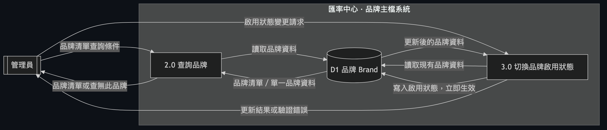
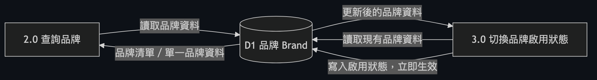

# Brand 品牌主檔系統藍圖

## 目的說明

本文件整合的範圍為單一 spec：`specs/backend/brand.md`（品牌主檔 Brand API）。目前系統中的 Brand 是一個**獨立、封閉**的模組——它不依賴任何其他 spec（`depends_on: []`），目前也沒有其他 spec 依賴它（尚無 fan-out、cascade 或 audit 路由連到其他 entity）。

整合後的系統現況非常單純：匯率中心內建 7 個品牌（`au`、`moneta`、`pug`、`star`、`um`、`vjp`、`vt`），這些品牌只能透過資料庫種子建立，**不提供新增或刪除的 API**。管理員只能做兩件事：查詢品牌清單／單一品牌，以及切換品牌的啟用狀態（`active`）。所有的狀態切換都是**立即生效**，不經過任何審核／待審流程。

## 完整架構圖

## 各 Entity / Data Store 說明

### 3.1 品牌（Brand）

*（節錄自完整架構圖）*

品牌是匯率中心裡「品牌範疇設定」的擁有者角色——雖然目前系統中還沒有其他 spec 掛載在它之上，但它被設計為未來所有品牌相關設定（例如匯率、幣別對、加減碼等）的根節點。目前品牌資料只有 7 筆種子資料，`code`（品牌代碼）與 `name`（品牌名稱）永久不可變更，管理員唯一能透過 API 調整的欄位是 `active`（啟用狀態）。

在整個系統大圖裡，品牌目前是一個**終端節點**：它只接受查詢與啟用狀態切換兩種操作，沒有向外的連動、沒有觸發其他資料的建立或刪除、也沒有走審核流程——所有更新都是讀取現有資料、驗證後直接寫入同一張表。由於邏輯單純（沒有 fan-out、沒有刪除限制、沒有審核路由），此處不另外繪製局部流程圖，架構圖（Diagram 1）已完整表達其行為。

詳細欄位、規則與 API 定義 → docs/backend/brand.md

## 通用／可重用模組

本次 scope（Brand）**未使用**任何審核（audit）或其他跨 entity 的可重用模組。品牌狀態切換是直接落地的即時更新，沒有「送出待審 → 審核通過/拒絕 → 套用」的流程。若未來其他品牌相關 spec（例如幣別對、加減碼設定）建立在 Brand 之上並引入審核機制，屆時應在該 spec 的整合文件中補上「審核模組如何在不了解品牌業務語意的前提下處理品牌相關的異動請求」的說明；目前這部分不存在，故此節維持空白是正確的現況呈現。

## End-to-End 情境走查

**情境一：查詢全部品牌**
1. 管理員呼叫品牌清單查詢，不帶任何篩選條件。
2. 系統直接讀取品牌資料表全部 7 筆種子資料。
3. 回傳完整品牌清單（含 `code`、`name`、`active`、建立/更新時間）。

**情境二：依啟用狀態篩選品牌**
1. 管理員查詢品牌清單，並帶入啟用狀態條件（例如只要啟用中的品牌）。
2. 系統在查詢資料表時同步套用此條件。
3. 回傳只符合該啟用狀態的品牌清單（例如只回傳目前啟用的品牌，或只回傳目前停用的品牌）。

**情境三：查詢不存在的品牌**
1. 管理員以一個不存在的品牌編號查詢單一品牌。
2. 系統在資料表中找不到對應資料。
3. 系統拒絕並說明查無此品牌。

**情境四：停用一個品牌**
1. 管理員針對指定品牌送出啟用狀態變更，內容為「停用」。
2. 系統先確認該品牌存在，再確認請求內容確實帶有啟用狀態欄位。
3. 系統直接把該品牌的啟用狀態改為停用並寫回資料表——此為即時生效的異動，不會產生任何待審核請求。
4. 系統回傳更新後的品牌完整資料，確認狀態已變為停用。

**情境五：送出缺少啟用狀態欄位的更新請求**
1. 管理員對指定品牌送出狀態更新請求，但請求內容中沒有帶啟用狀態欄位（或該欄位為空）。
2. 系統驗證請求內容，發現必要欄位缺漏。
3. 系統拒絕此次請求並說明缺少啟用狀態欄位，資料表內容維持原狀，不做任何變更。

**情境六：嘗試新增或刪除品牌**
1. 沒有任何 API 可以讓管理員新增新的品牌，也沒有任何 API 可以刪除既有品牌。
2. 品牌只能透過資料庫種子方式存在，`code` 與 `name` 一旦建立即永久不可變更。
3. 這確保 7 個品牌（`au`、`moneta`、`pug`、`star`、`um`、`vjp`、`vt`）在系統生命週期中維持固定且穩定的身份識別，不會因誤操作而消失或被竄改。

## 延伸閱讀

| 章節 | 對應詳細文件 |
|---|---|
| 3.1 品牌（Brand） | docs/backend/brand.md |
