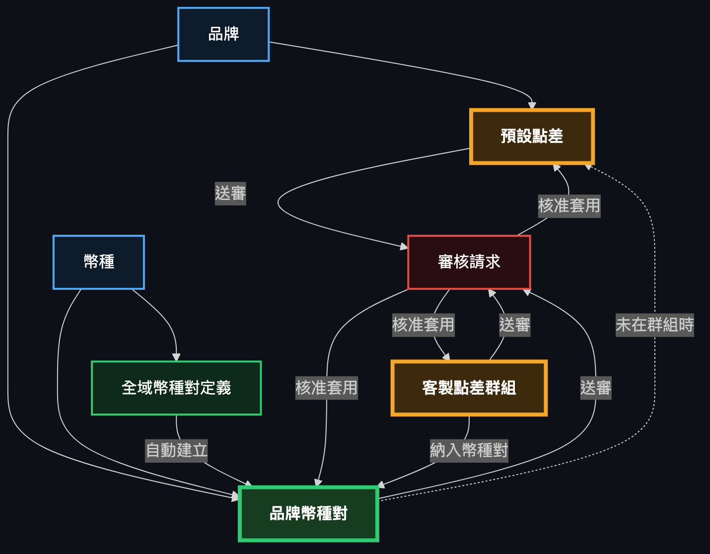
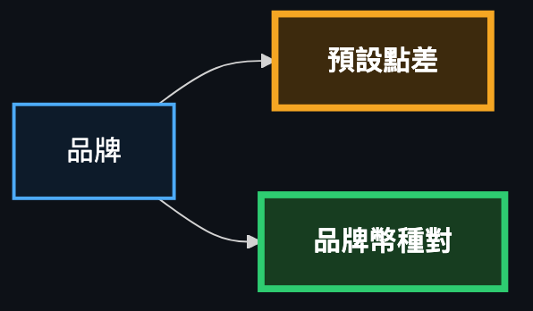
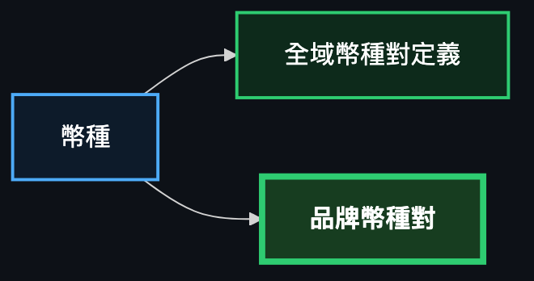
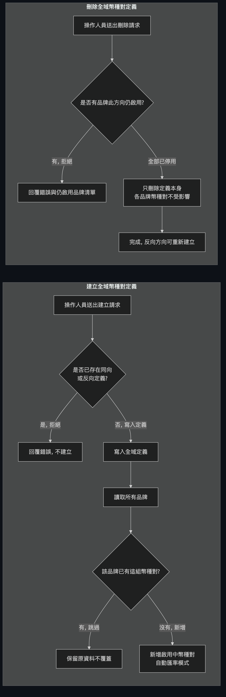
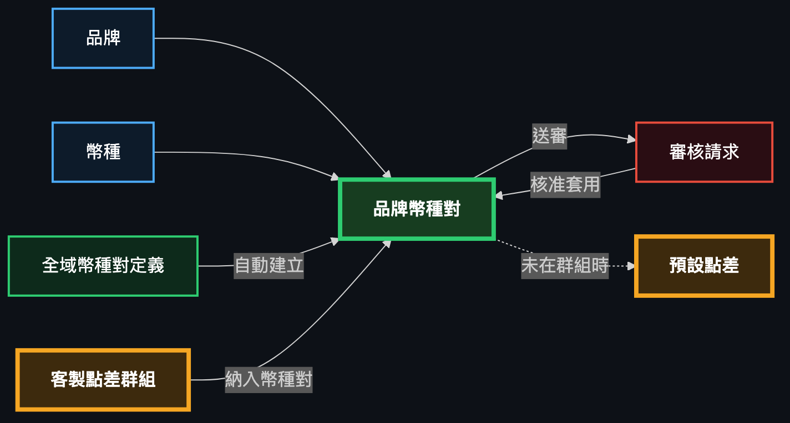
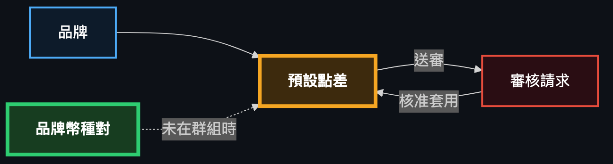
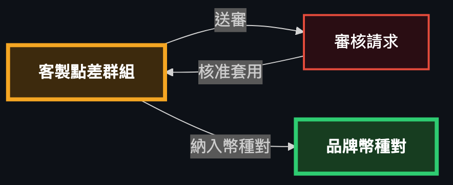
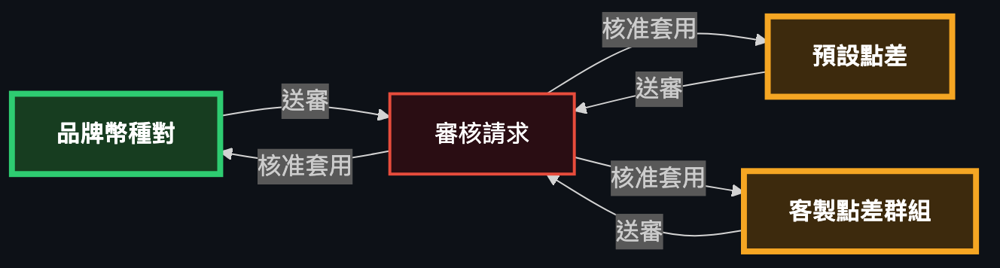

# 品牌幣種對與點差管理系統 — 整合藍圖

## 1. 文件目的與整合範圍

這份文件整合了以下 7 份後端規格，呈現「品牌 × 幣種 × 幣種對 × 點差 × 審核」這一整套系統目前真正運作的樣子，而不是逐份規格分開介紹：

- `specs/backend/brand.md`（品牌）
- `specs/backend/currency.md`（幣種）
- `specs/backend/currency-pair-definition.md`（全域幣種對定義）
- `specs/backend/currency-pair.md`（品牌幣種對）
- `specs/backend/currency-pair-approval.md`（品牌幣種對的審核串接）
- `specs/backend/spread.md`（點差：預設點差、客製點差群組）
- `specs/backend/audit.md`（通用審核模組）

**系統現在的樣子**可以分成三層來理解：

1. **基礎資料層（支援性）**：「品牌」與「幣種」是兩張獨立、變動很少的主檔資料。品牌只能開關啟用狀態，幣種可以完整增刪改查，但代碼建立後不可再改，而且只要還被任何品牌幣種對用到就不能刪除。
2. **核心業務層（本系統的重點功能）**：
   - **品牌幣種對**是本系統實際交易/報價會用到的資料，但它不能被單獨手動新增 —— 必須先透過「**全域幣種對定義**」一次性地建立某個（基準幣、報價幣）方向，系統才會自動幫「每一個品牌」各生成一筆對應的品牌幣種對。品牌幣種對建立好之後，「修改匯率/啟用狀態」與「刪除」都不是直接生效，而是要送出**審核申請**，經核准後才會真正套用到資料上。
   - **點差（點差預設值與客製點差群組）**是掛在品牌幣種對之上的加值資訊，同樣是核心功能：每個品牌有一筆「預設點差」，可以額外把多個幣種對組成「客製點差群組」共用一組點差，沒被放進任何群組的幣種對就自動套用品牌的預設點差。點差的所有異動（預設點差修改、群組新增/修改/刪除）也都要走審核。
3. **通用機制層（可重用元件）**：「審核模組」是一個完全不認識「品牌」「幣種」「幣種對」「點差」的通用簽核引擎，任何功能只要照著它的接口實作，就能把自己的新增/修改/刪除變成「先送審、核准才生效」的流程，而不需要修改審核模組本身。

換句話說：品牌與幣種是地基，全域幣種對定義是一次性的建立動作（一次建立、自動鋪到全部品牌），品牌幣種對與點差才是每天會被異動、也是唯一真正需要人工審核把關的資料。

---

## 2. 完整架構圖

---

## 3. 各 Entity / Data Store 說明

### 3.1 品牌（Brand）

*（節錄自完整架構圖）*

**說明**：固定的 7 個品牌種子資料（AU、MONETA、PUG、STAR、UM、VJP、VT），只能查詢與開關啟用狀態，不提供新增或刪除。

| Field | Type/Role | Rule |
|---|---|---|
| id | 主鍵 | 系統產生 |
| code | 品牌代碼 | 建立後不可修改（僅透過資料庫種子產生） |
| name | 品牌名稱 | 建立後不可修改（僅透過資料庫種子產生） |
| active | 啟用狀態 | 唯一可透過 API 修改的欄位 |
| createdAt / updatedAt | 時間戳記 | 系統維護 |

**Constraints**
- 沒有新增、沒有刪除的功能 —— 品牌只能由資料庫種子產生一次。
- `code`、`name` 是不可變欄位。
- 修改啟用狀態是**直接套用**，不需要送審。

### 3.2 幣種（Currency）

*（節錄自完整架構圖）*

**說明**：幣種主檔，提供完整的增刪改查，是幣種對（全域定義與品牌幣種對）引用的基礎資料。目前沒有啟用/停用的概念 —— 一個幣種只有「存在」或「被刪除」兩種狀態。

| Field | Type/Role | Rule |
|---|---|---|
| id | 主鍵 | 系統產生 |
| code | 幣種代碼 | 建立時必填，3 個大寫字母，唯一；**建立後不可修改** |
| name | 名稱 | 必填，最長 100 字 |
| nameZh | 中文名稱 | 選填 |
| symbol | 符號 | 選填 |
| decimalPlaces | 小數位數 | 必填，0–8 |
| createdAt / updatedAt | 時間戳記 | 系統維護 |

**Constraints**
- 沒有 `active` 欄位、沒有啟用/停用篩選 —— 這個概念已被移除。
- `code` 只能在建立時設定，修改請求中若仍帶入 `code` 會被系統直接忽略（不會報錯）。
- 刪除幣種前，系統會檢查是否仍被任何品牌幣種對當作基準幣或報價幣使用，若是則拒絕刪除（狀態碼 409，供工程師參考）。這個檢查只看「目前生效」的幣種對，不會去看還在待審核中的申請。
- 新增/修改/刪除全部是**直接套用**，不需要送審。

### 3.3 全域幣種對定義（Currency Pair Definition）

*（節錄自完整架構圖）*

**說明**：提供一個「不分品牌」的主檔，用來一次性地定義某個（基準幣、報價幣）方向，並在建立的同一個動作裡，自動幫「所有品牌」各生成一筆品牌幣種對。這是本系統唯一一個「直接套用、不經過審核」的核心業務異動，因為它的設計目的就是快速鋪貨到全品牌。

| Field | Type/Role | Rule |
|---|---|---|
| id | 主鍵 | 系統產生 |
| baseCurrencyId / baseCurrencyCode | 基準幣 | 建立時必填且必須存在；**建立後不可修改** |
| quoteCurrencyId / quoteCurrencyCode | 報價幣 | 建立時必填且必須存在，且不可與基準幣相同；**建立後不可修改** |
| forwardPrecision（正向精度） | 整數 0–8 | 必填，建立後可修改 |
| reversePrecision（反向精度） | 整數 0–8 | 必填，建立後可修改 |
| createdAt / updatedAt | 時間戳記 | 系統維護 |

**Constraints**
- 同一個方向不能重複建立；反向方向（把基準幣與報價幣對調）也不能重複建立 —— 兩者都會被拒絕（409）。
- 方向（基準幣/報價幣）是**不可變欄位**，只有精度可以修改。
- 刪除只會移除「定義」這一筆資料本身，**絕對不會**去刪除或修改它當初鋪出去的任何品牌幣種對 —— 那些幣種對之後就是獨立資料，照品牌幣種對自己的規則（見 3.4）去異動。
- **刪除有前提**：必須確認「所有品牌」在這個方向上的品牌幣種對都已經是停用狀態，否則拒絕刪除，並附上目前仍是啟用中的品牌清單。某個品牌完全沒有這筆幣種對（例如被獨立刪除過）不會擋刪除，只有「存在且仍啟用」才會擋。
- 刪除成功後，這個方向釋放出來，反向方向就可以重新被建立。
- 新增/修改/刪除全部是**直接套用**，不需要送審。

### 3.4 品牌幣種對（Currency Pair）—— 核心功能

*（節錄自完整架構圖）*

**說明**：每個品牌實際使用的幣種對資料，帶有匯率與啟用狀態。這是核心業務功能。**沒有單獨新增的功能** —— 一筆品牌幣種對只能透過 3.3 的全域定義建立時自動產生。修改與刪除都不是直接生效，而是要送出審核申請。

| Field | Type/Role | Rule |
|---|---|---|
| id | 主鍵 | 系統產生 |
| brandId / brandCode | 所屬品牌 | 必須存在的品牌 |
| baseCurrencyId / baseCurrencyCode | 基準幣 | 必須存在，且與報價幣不同 |
| quoteCurrencyId / quoteCurrencyCode | 報價幣 | 必須存在，且與基準幣不同 |
| rate（匯率） | 數值，可為空 | 詳見下方匯率規則 |
| rateType（匯率模式） | 手動（MANUAL）或自動（AUTO） | 詳見下方匯率規則 |
| active | 啟用狀態 | 布林值 |
| createdAt / updatedAt | 時間戳記 | 系統維護 |

**Constraints**
- **沒有新增功能**：唯一產生的方式是全域幣種對定義建立時的自動鋪貨。
- 同一品牌下（brandId, baseCurrencyId, quoteCurrencyId）不可重複；不同品牌可以有相同的（基準幣、報價幣）組合。
- **匯率規則**：當模式是「自動」時，匯率一律被清成空值，即使申請內容裡有帶值也會被忽略、不會報錯；當模式是「手動」時，有效匯率（申請內容有帶值就用申請的，沒帶就沿用原本的值）必須存在且大於 0，否則會被拒絕（400）。
- **修改與刪除都必須送審**：送出申請後會產生一筆「待審核」的審核請求，記錄「異動前的資料」與「異動後的提議內容」，原始資料在核准前完全不變。同一筆幣種對如果已經有一個待審請求，再送第二個會被拒絕（409）。
- 查詢（清單、單筆）一律讀取目前生效的資料，不受待審請求影響。

### 3.5 品牌預設點差（Spread Default）—— 核心功能

*（節錄自完整架構圖）*

**說明**：每個品牌從建立起就自動擁有一筆預設點差，涵蓋入金（deposit）與出金（withdraw）兩個點差欄位。沒有被放進任何客製點差群組的幣種對，都是套用這筆預設點差。

| Field | Type/Role | Rule |
|---|---|---|
| id | 主鍵 | 系統產生 |
| brandId / brandCode | 所屬品牌 | 每個品牌恰好一筆，系統種子產生 |
| depositSpread（入金點差） | 數值 ≥ 0 | 必填 |
| withdrawSpread（出金點差） | 數值 ≥ 0 | 必填 |
| createdAt / updatedAt | 時間戳記 | 系統維護 |

**Constraints**
- 沒有新增、沒有刪除功能 —— 每個品牌的這筆資料是種子產生、恆常存在的。
- **唯一能異動的是修改**，而且修改必須送審 —— 送出申請後產生待審請求，核准後才真正更新入金/出金點差。
- 同一筆預設點差如果已有待審請求，再送第二個會被拒絕（409）。

### 3.6 客製點差群組（Spread Group）與群組成員（Spread Group Member）—— 核心功能

*（節錄自完整架構圖）*

**說明**：客製點差群組讓多個幣種對共用同一組（入金/出金）點差，是核心業務功能。一個品牌可以建立多個群組，一個幣種對「同一時間最多只能屬於一個群組」。新增、修改、刪除都必須送審。

**Spread Group Field 表**

| Field | Type/Role | Rule |
|---|---|---|
| id | 主鍵 | 系統產生 |
| brandId / brandCode | 所屬品牌 | 必須存在的品牌 |
| name（群組名稱） | 字串 | 必填，非空白，最長 100 字，同品牌內不可重複 |
| depositSpread / withdrawSpread | 數值 ≥ 0 | 必填 |
| members（成員清單） | 幣種對清單 | 每個成員必須屬於同一個品牌 |
| createdAt / updatedAt | 時間戳記 | 系統維護 |

**Spread Group Member Field 表**

| Field | Type/Role | Rule |
|---|---|---|
| id | 主鍵 | 系統產生 |
| spreadGroupId | 所屬群組 | 必填 |
| currencyPairId | 幣種對 | 必須屬於群組所在的品牌；**同一個幣種對只能出現在一筆成員紀錄裡**（不能同時屬於兩個群組） |
| baseCurrencyCode / quoteCurrencyCode | 幣種代碼（關聯查詢用） | 唯讀，方便顯示 |
| createdAt | 時間戳記 | 系統維護 |

**Constraints**
- 新增/修改/刪除**全部要送審**，核准前群組資料與成員資料都不會被寫入或變更。
- 新增群組時，若名稱已被「目前生效的其他群組」用掉，或已有另一筆「待審核的新增申請」用了同樣的（品牌, 名稱）組合，都會被拒絕（409）。
- 一個幣種對如果在申請內容裡被指定加入某個群組，**即使它目前已經屬於另一個群組，系統也不會拒絕這個申請** —— 一旦核准，系統會自動把它從原本的群組移出、加入新的群組（移動，而不是報錯）。
- 修改群組時，若申請內容有帶新的成員清單，核准後會用「整組取代」的方式套用：清單裡被拿掉的幣種對會回復使用品牌預設點差，新加入的會自動脫離原群組；若申請內容完全沒帶成員清單欄位，核准後成員維持不變。
- 刪除群組核准後，會連同移除所有成員紀錄，這些幣種對之後查詢生效點差時會改用品牌的預設點差。
- 另外提供一個「查詢生效點差」的功能：輸入一個幣種對，回答它目前實際套用的是哪個群組的點差，還是品牌的預設點差 —— 這個查詢永遠讀取目前生效、已核准的資料，不會被還在待審核的申請影響。

### 3.7 審核請求（Audit Request）

*（節錄自完整架構圖）*

**說明**：所有需要審核的異動（品牌幣種對的修改/刪除、預設點差的修改、點差群組的新增/修改/刪除）最終都會落在這張表裡，是整個審核機制的紀錄與狀態中心。詳細的通用設計見第 4 節。

| Field | Type/Role | Rule |
|---|---|---|
| id | 主鍵 | 系統產生 |
| entityType | 這筆申請是關於哪種資料 | 例如「品牌幣種對」「品牌預設點差」「客製點差群組」 |
| actionType | 新增/修改/刪除 | 三選一 |
| entityId | 對應的資料 id | 新增類型在核准前為空，核准後補上新產生的 id |
| beforeSnapshot（異動前的資料） | 保留的原始資料 | 新增類型沒有這欄（空） |
| afterSnapshot（異動後的提議內容） | 提議要變成的資料 | 刪除類型沒有這欄（空） |
| summary | 人可讀的摘要文字 | 例如「PUG · USD/TWD」 |
| status（狀態） | 待審核 / 已核准 / 已拒絕 | 只有「待審核」狀態能被審核 |
| requestedBy / requestedAt | 申請人與申請時間 | 申請人為選填，無登入系統，自由填寫 |
| reviewedBy / reviewedAt / rejectReason | 審核人、審核時間、拒絕原因 | 拒絕時「拒絕原因」為必填 |
| createdAt / updatedAt | 時間戳記 | 系統維護 |

**Constraints**
- 同一筆資料（同一個 entityType + entityId）同時只能有一筆「待審核」的請求，重複送出會被拒絕（409）。
- 已經被核准或已經被拒絕的請求，不能再被核准或拒絕（409）—— 每筆請求只能被審核一次。
- 核准的當下，系統會**重新檢查一次業務規則**（不只是送出當時檢查一次） —— 如果狀態已經改變導致規則不再滿足（例如名稱後來被別人用掉了），核准會失敗並回覆對應的錯誤，但這筆申請仍維持「待審核」，不會被系統自動拒絕。
- 拒絕的動作完全不會去讀取或檢查任何業務資料，只單純把狀態改成「已拒絕」並記錄原因。

---

## 4. 通用/可重用模組：審核（Audit）機制

審核模組被設計成**完全不認識**「品牌」「幣種」「幣種對」「點差」這些具體業務資料 —— 它只認識「某種資料類型的某一筆，要新增/修改/刪除，現在需要有人核准」這件事本身。任何功能要接上審核機制，只需要照著一份固定的「合約」實作四個方法，不需要動到審核模組的任何程式碼。這四個方法用白話說明如下：

1. **取得目前資料的方法**：給我一個 id，回傳這筆資料現在的樣子（給審核畫面顯示「異動前」用）。如果 id 找不到，由這個功能自己丟出「找不到」的錯誤。
2. **檢查是否可以執行的方法**：給我一份「提議要變成的內容」，檢查它是否符合這個功能自己的業務規則（例如幣別要存在、名稱不能重複、金額不能是負的）。這個方法在「送出申請的當下」會跑一次，在「審核人員按下核准的當下」還會再跑一次（因為送出申請跟真正核准之間，資料可能已經被別的異動改變了）。**新增類型的重複檢查**（例如同一個品牌用同一個名稱又送了一次新增申請）也是由這個方法自己處理，因為新增時還沒有正式的 id 可以讓通用模組去比對。
3. **真正執行變更的方法**：只有在核准的那一刻才會被呼叫，負責把「提議的內容」真正寫進這個功能自己的資料表（新增就真的新增一筆、修改就真的覆蓋、刪除就真的刪除）。回傳這筆資料的 id（新增時是新產生的 id，其他情況原樣傳回）。
4. **產生摘要文字的方法**：把資料整理成一句簡短好讀的文字，用在審核清單上讓審核人員一眼看懂這是哪一筆（例如「PUG · USD/TWD」或「AU · 預設點差」）。

審核模組本身只做**四件通用的事**，而且完全不知道上面四個方法內部做了什麼：
- 收到「送出申請」的要求時，呼叫對應功能的「取得目前資料」與「檢查是否可以執行」，通過的話就存一筆「待審核」紀錄。
- 收到「核准」的要求時，先確認狀態還是「待審核」，再重新呼叫一次「檢查是否可以執行」，通過才呼叫「真正執行變更」，然後把狀態改成「已核准」。
- 收到「拒絕」的要求時，單純把狀態改成「已拒絕」並記錄原因，完全不去呼叫任何功能自己的方法。
- 提供統一的清單/單筆查詢 API，讓審核畫面可以用同一套介面去看「品牌幣種對」「預設點差」「點差群組」等各種不同類型的待審申請，不需要為每種類型另外開發專屬頁面或 API。

目前已經接上這套機制的功能有三個：品牌幣種對（修改、刪除）、品牌預設點差（修改）、客製點差群組（新增、修改、刪除）。

---

## 5. End-to-End 情境走查

**情境一：建立一個新的幣種對方向，自動鋪到所有品牌**
1. 業務人員以（USD, JPY）呼叫建立全域幣種對定義。
2. 系統確認 USD/JPY 這個方向（含反向 JPY/USD）目前都還沒有人建立過定義。
3. 系統寫入這筆定義，並讀取目前所有品牌。
4. 對每個品牌，若該品牌還沒有 USD/JPY 的品牌幣種對，系統自動幫它建立一筆（自動匯率模式、匯率空值、啟用中）；若該品牌已經有一筆（例如之前手動建立過），就保留原樣不動。
5. 全部動作在同一個交易裡完成，任何一步失敗，整筆定義與所有鋪貨都不會留下痕跡。

**情境二：修改品牌幣種對匯率，經審核後生效**
1. 業務人員針對 PUG 品牌的 USD/TWD 幣種對，提出把匯率改成手動、設定新匯率的申請。
2. 系統確認這筆幣種對目前沒有其他待審申請，讀取目前資料作為「異動前」，把申請內容合併成「異動後」提議。
3. 系統驗證品牌/幣別存在、匯率規則（手動模式必須有大於 0 的匯率）都通過，建立一筆「待審核」的審核請求，回覆申請已受理；此時 PUG 的 USD/TWD 匯率**還是原來的值**。
4. 審核人員打開審核清單，看到這筆申請的「異動前/異動後」內容，決定核准。
5. 系統重新驗證一次規則（確認資料沒有在等待期間變得不合規），通過後真正把新匯率寫進 PUG 的 USD/TWD 資料，狀態改成「已核准」。

**情境三：全域定義要刪除，必須先把所有品牌的該方向停用**
1. 業務人員嘗試刪除 USD/JPY 的全域定義。
2. 系統檢查所有品牌目前 USD/JPY 幣種對的啟用狀態，發現 PUG、AU 兩個品牌仍是啟用中，拒絕刪除並回覆這兩個品牌的代碼。
3. 業務人員分別對 PUG、AU 的 USD/JPY 幣種對提出「停用」的修改申請（走情境二的審核流程），審核人員逐一核准。
4. 業務人員再次嘗試刪除 USD/JPY 的全域定義，此時所有品牌該方向都已停用（或根本沒有該筆資料），刪除成功，但所有品牌原本的 USD/JPY 幣種對資料本身完全沒被動到。
5. 因為這個方向的定義已被刪除，業務人員現在可以改建立反向（JPY, USD）的全域定義。

**情境四：把幣種對從一個點差群組移動到另一個群組**
1. 幣種對 USD/JPY 目前屬於「Group A」。
2. 業務人員對「Group B」提出修改申請，成員清單裡包含 USD/JPY。
3. 系統驗證 USD/JPY 存在且屬於 Group B 所在的品牌，不因為它目前屬於 Group A 而拒絕，建立待審核申請。
4. 審核人員核准這筆申請。
5. 系統套用時，USD/JPY 自動從 Group A 的成員名單移除、加入 Group B 的成員名單，套用 Group B 的點差；Group A 若沒有做其他修改則不受影響。

**情境五：刪除點差群組後，成員回復使用預設點差**
1. 業務人員對「Group A」提出刪除申請，系統確認沒有其他待審申請後建立待審核紀錄。
2. 審核人員核准。
3. 系統刪除 Group A 本身以及它所有的成員紀錄。
4. 之後查詢原本屬於 Group A 的任一幣種對的「生效點差」，結果會顯示來源為「預設點差」，金額改用該幣種對所屬品牌的品牌預設點差。

**情境六：幣種因被幣種對引用而無法刪除**
1. 業務人員嘗試刪除幣種 USD。
2. 系統檢查目前生效的幣種對資料，發現有多筆幣種對用 USD 當基準幣或報價幣，拒絕刪除（狀態碼供工程師參考：409），並附上該幣種 id。
3. 業務人員需要先透過審核流程把所有引用 USD 的品牌幣種對刪除並核准通過。
4. 全部引用清除後，業務人員再次嘗試刪除 USD，此時系統檢查不到任何引用，刪除成功。

---

## 6. Mutation/Audit Matrix

| Feature | 新增 | 修改 | 刪除 | 查詢 |
|---|---|---|---|---|
| 品牌（Brand） | 沒有這個功能（僅資料庫種子產生） | 僅能修改啟用狀態，直接套用，不需審核 | 沒有這個功能 | 直接查詢，可依啟用狀態篩選 |
| 幣種（Currency） | 直接套用，不需審核 | 直接套用，不需審核；但幣種代碼建立後不可修改（即使送出也會被忽略） | 直接套用，但若仍被任一品牌幣種對引用會被拒絕 | 直接查詢全部，沒有篩選條件 |
| 全域幣種對定義（Currency Pair Definition） | 直接套用，不需審核；同時自動幫所有品牌各建立一筆對應的品牌幣種對 | 直接套用，不需審核；只能改正向/反向精度，方向不可改 | 直接套用，不需審核；但必須先確認所有品牌此方向的幣種對都已停用，否則拒絕 | 直接查詢，可用基準幣/報價幣篩選 |
| 品牌幣種對（Currency Pair） | 沒有這個功能（只能透過全域定義自動產生） | 需送審核准後套用；送出後產生待審請求，核准前原資料不變 | 需送審核准後套用；同左 | 直接查詢目前生效資料，不受待審請求影響 |
| 品牌預設點差（Spread Default） | 沒有這個功能（品牌建立時自動產生一筆） | 需送審核准後套用 | 沒有這個功能 | 直接查詢，可依品牌篩選 |
| 客製點差群組（Spread Group，含成員） | 需送審核准後套用（核准後才真正建立群組與成員） | 需送審核准後套用（名稱/點差/成員清單皆可調整，成員清單為整組取代） | 需送審核准後套用（核准後刪除群組並移除所有成員，成員回復使用預設點差） | 直接查詢，含成員清單；另有「查詢生效點差」功能可查任一幣種對目前實際套用的點差，不受待審影響 |
| 審核請求（Audit Request） | 沒有獨立的新增 API，是由上述各功能送審時自動產生 | 沒有「修改」的概念，只能核准或拒絕 | 沒有這個功能 | 可依資料類型/狀態/動作類型查詢清單，或用 id 查詢單筆 |

---

## 7. Cross-Spec Constraint Matrix

| Rule（白話規則） | Source spec | Effect（白話效果） |
|---|---|---|
| 幣種代碼建立後不可修改 | `currency-pair.md`（對 `currency.md` 的補充） | 修改幣種時，即使請求裡帶了新的代碼，系統也會直接忽略、不會報錯，代碼永遠維持建立時的值 |
| 幣種被任一品牌幣種對引用時不可刪除 | `currency-pair.md` | 刪除幣種前系統會先檢查是否仍被引用，若是則拒絕刪除並告知原因（供工程師參考的狀態碼：409） |
| 品牌幣種對只能透過全域定義建立，沒有單獨新增的入口 | `currency-pair-definition.md`、`currency-pair.md` | 系統完全沒有「單獨幫某個品牌新增一筆幣種對」的功能；必須先建立全域幣種對定義，系統才會自動幫每個品牌各生成一筆 |
| 全域定義刪除前必須所有品牌該方向都已停用 | `currency-pair-definition.md` | 只要有任一品牌該方向仍是啟用中，刪除定義就會被拒絕，並附上仍啟用的品牌清單（供工程師參考的狀態碼：409） |
| 品牌幣種對的修改與刪除一定要走審核 | `currency-pair-approval.md`、`audit.md` | 修改或刪除都不會馬上生效，而是先產生一筆待審核申請，核准後才真正套用到資料（供工程師參考：回覆狀態碼 202，而非傳統的 200/204） |
| 點差（預設點差、客製群組）所有異動一定要走審核 | `spread.md`、`audit.md` | 預設點差修改、群組新增/修改/刪除，一律先產生待審核申請，核准後才真正生效 |
| 一個幣種對同時最多只能屬於一個點差群組 | `spread.md` | 把某個幣種對指定加入新群組不會被拒絕，核准後系統會自動把它從原本所屬的群組移出、加入新群組 |
| 點差群組刪除後，原成員自動改用品牌預設點差 | `spread.md` | 核准刪除群組後，原本的成員紀錄會被一併移除，之後查詢這些幣種對的生效點差會改用品牌的預設點差 |
| 同一筆資料同時只能有一筆待審核申請 | `audit.md` | 不論是品牌幣種對還是點差群組，只要同一筆資料已經有一筆待審核申請，再送第二筆會被拒絕（供工程師參考：409） |
| 新增類型的申請，自然鍵重複要由各功能自己檢查 | `audit.md`（通用規則）、`currency-pair-approval.md`、`spread.md`（各自實作） | 因為新增時還沒有正式的資料 id 可供通用模組比對，所以「同一品牌 + 同一群組名稱是否已有另一筆待審新增」這類檢查，是點差群組這個功能自己負責的，不是審核模組通用邏輯的一部分 |
| 核准當下會重新驗證業務規則，失敗仍維持待審核 | `audit.md` | 核准的瞬間系統會再檢查一次規則（例如名稱是否又被別人用掉），若不符合就回覆錯誤，但這筆申請不會被自動拒絕，留給審核人員再次判斷 |

---

## 8. Source-of-Truth Mapping

| 整合章節 | 對應規格檔案 |
|---|---|
| 3.1 品牌（Brand） | `specs/backend/brand.md` |
| 3.2 幣種（Currency） | `specs/backend/currency.md`（不可變代碼與刪除引用檢查定義在 `specs/backend/currency-pair.md`） |
| 3.3 全域幣種對定義（Currency Pair Definition） | `specs/backend/currency-pair-definition.md` |
| 3.4 品牌幣種對（Currency Pair） | `specs/backend/currency-pair.md`、`specs/backend/currency-pair-approval.md` |
| 3.5 品牌預設點差（Spread Default） | `specs/backend/spread.md` |
| 3.6 客製點差群組與成員（Spread Group / Spread Group Member） | `specs/backend/spread.md` |
| 3.7 審核請求（Audit Request）資料結構 | `specs/backend/audit.md` |
| 4. 通用審核模組設計 | `specs/backend/audit.md` |
| 5. End-to-End 情境走查 | `specs/backend/currency-pair-definition.md`、`specs/backend/currency-pair-approval.md`、`specs/backend/spread.md`、`specs/backend/currency-pair.md` |
| 6. Mutation/Audit Matrix | 彙整自全部 7 份規格 |
| 7. Cross-Spec Constraint Matrix | 彙整自 `specs/backend/currency.md`、`specs/backend/currency-pair.md`、`specs/backend/currency-pair-definition.md`、`specs/backend/currency-pair-approval.md`、`specs/backend/spread.md`、`specs/backend/audit.md` |
