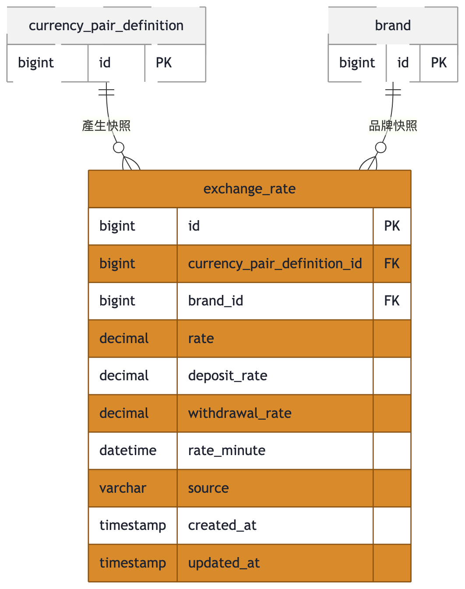

# 匯率中心資料庫 ER 模型總覽

本資料庫是「匯率中心」的核心資料庫，涵蓋幣種與幣種對的主檔管理、各品牌自身的點差設定、外部匯率同步後的歷史快照，以及品牌幣種對／點差異動所需的審核流程。整體依照 FK 關聯自然分成四大功能群組：**幣種與幣種對**（currency-pair）、**品牌與點差**（brand-spread）、**匯率快照**（exchange-rate）、**審核申請**（audit）。

## 全景

## 1. 幣種與幣種對（currency-pair）

此群組涵蓋幣種主檔、全系統共用（不分品牌）的幣種對定義，以及每個品牌各自對該幣種對的啟用與匯率設定。

- **currency**：幣種主檔（如 USD、JPY），`code` 建立後不可變更，只有 `name`／`symbol`／`decimal_places` 可修改。被 `currency_pair_definition.base_currency_id`／`quote_currency_id` 參照，皆未設定 `ON DELETE`，預設為 RESTRICT — 只要仍有幣種對定義引用該幣種，就無法刪除。
- **currency_pair_definition**：全系統共用、不分品牌的幣種對定義（基準幣／報價幣／匯率精度），無啟用停用欄位。刪除前應用層會先確認底下所有品牌幣種對皆未啟用；一旦刪除，其下所有 `currency_pair` 與 `exchange_rate` 快照皆 `ON DELETE CASCADE` 一併清除。
- **currency_pair**：品牌對某幣種對的啟用狀態與匯率設定（AUTO／MANUAL），並以 `spread_group_id` 承載「此幣種對加入哪個點差群組」。`currency_pair_definition_id` 為 `ON DELETE CASCADE`；`brand_id` 未設定 `ON DELETE`（預設 RESTRICT）；`spread_group_id` 為 `ON DELETE SET NULL`（群組被刪除時成員退回品牌預設點差，幣種對本身不受影響）。

## 2. 品牌與點差（brand-spread）

此群組涵蓋品牌主檔，以及品牌的預設點差與可自訂的點差群組，兩者都是以「百分比、乘法套用在基礎匯率上、上限 100%」的方式決定入金／出金加成。

- **brand**：品牌主檔，`code`／`name` 建立後不再變更，只有 `active` 會被修改。被 `brand_spread`／`spread_group` 以 `ON DELETE CASCADE` 參照；被 `currency_pair`／`exchange_rate` 參照則未設定 `ON DELETE`（預設 RESTRICT）。
- **brand_spread**：品牌的預設點差（`deposit_spread_percent`／`withdrawal_spread_percent`，入金／出金點差百分比，介於 0–100 之間、乘法套用），每品牌僅一筆。`brand_id` 為 `ON DELETE CASCADE` — 刪除品牌時一併刪除其預設點差列。
- **spread_group**：品牌自訂的點差群組（`deposit_spread_percent`／`withdrawal_spread_percent`，同樣介於 0–100 之間、乘法套用），群組名稱同品牌內唯一。`brand_id` 為 `ON DELETE CASCADE`；群組被刪除本身不會刪除成員幣種對，而是透過 `currency_pair.spread_group_id` 的 `ON DELETE SET NULL` 讓成員退回品牌預設點差。

## 3. 匯率快照（exchange-rate）

此群組只有一張表，記錄每次外部匯率同步當下、依各品牌當時生效點差換算出的原始／入金／出金匯率快照，屬於一次寫入、之後不再重算的歷史紀錄。

- **exchange_rate**：每分鐘一筆的匯率快照（原始匯率／入金匯率／出金匯率），一次寫入後不再重算，是歷史紀錄而非即時視圖。`currency_pair_definition_id` 為 `ON DELETE CASCADE`（定義被刪除時歷史快照一併清除）；`brand_id` 未設定 `ON DELETE`（預設 RESTRICT）。

## 4. 審核申請（audit）

此群組記錄品牌幣種對與點差相關異動（新增／修改／刪除）從送出審核、到核准／駁回／撤回的完整歷程，且刻意不對任何表建立外鍵，以免歷史紀錄被上游資料刪除所牽連。

- **audit_request**：品牌幣種對與點差相關異動（新增／修改／刪除）的待審與歷史申請紀錄。刻意不對任何表建立外鍵 — `entity_id`／`brand_id` 為一般欄位、不受 FK 保護，即使目標資料列或品牌後續被刪除，這裡的歷史紀錄也不受影響、不會被連動刪除。
