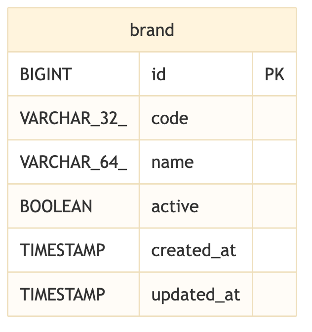

# brand 資料庫 ER 模型

匯率中心資料庫目前僅涵蓋單一主檔功能：品牌主檔（brand）。此主檔是所有「品牌範圍設定」（brand-scoped configuration）的擁有者根節點，目前資料庫中只存在 `brand` 這一張表，尚未與任何其他表建立關聯，形成一個完全獨立（FK-isolated）的功能群集。未來其他功能模組加入後會再與此主檔建立外鍵關聯。

## 全景

## brand

品牌主檔負責管理匯率中心內建的七個品牌（au、moneta、pug、star、um、vjp、vt），並可個別開啟或關閉。

- **brand**：品牌主檔表，儲存七個內建品牌的代碼、名稱與啟用狀態；`code` 與 `name` 僅在建立資料時設定一次、之後不再變更，僅 `active` 欄位會被應用程式修改。目前沒有任何表以外鍵參照 `brand`，因此沒有刪除保護規則。
