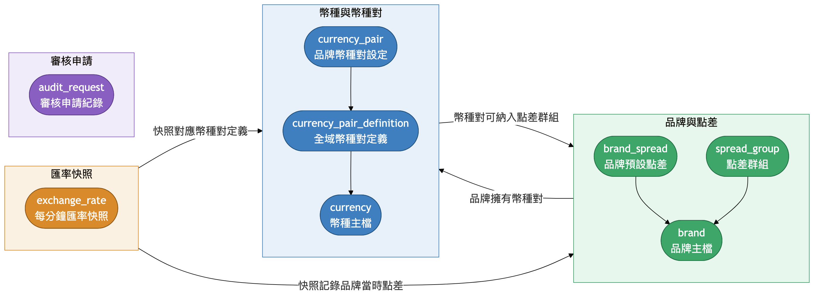
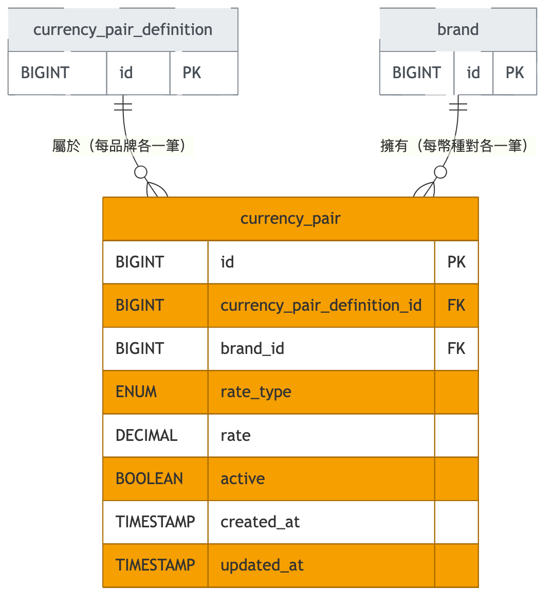
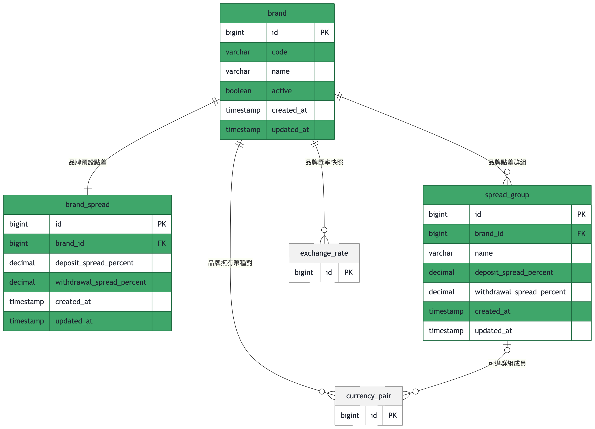
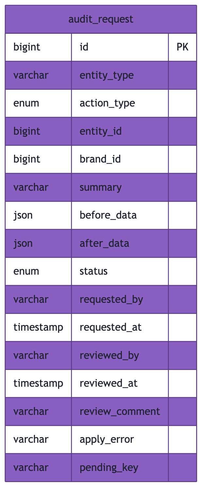

# 資料庫全景總覽

wdd 系統的資料庫圍繞著跨境匯兌業務的三大功能運作：**幣種對管理**（currency、currency_pair、currency_pair_definition）負責定義可交易的幣種與各品牌下實際掛牌的匯率幣種對；**品牌點差管理**（brand、spread_default、spread_group、spread_group_member）負責維護七個品牌各自的預設點差，以及可將多個幣種對歸入同一組的客製點差群組；**審核機制**（audit_request）則是一張與具體業務實體完全無關的獨立表，承載新增／修改／刪除的「送審 → 待審 → 核准或拒絕」通用審批流程。前兩大功能之間透過外鍵緊密相連（品牌擁有自己的幣種對與點差設定，幣種對可選擇性地被歸入某個點差群組），而審核機制刻意不與任何資料表建立外鍵關聯，任何功能都能以泛用的方式掛接進去而不需異動此表結構。

## 全景

以上是整個資料庫的縮圖地圖：三個大功能各自用一個色塊圈起來（藍色＝幣種對管理、綠色＝品牌與點差管理、粉紅色＝刻意孤立的審核機制），色塊之間的箭頭標出跨功能的關聯（品牌擁有幣種對；幣種對可被納入點差群組），色塊內部只畫出各表之間的從屬關係，先掌握整體輪廓即可。每張表實際的欄位、鍵值與關聯基數，在下方對應的功能小節中有完整圖解。

## 1. 幣種對叢集（currency-pair）

此叢集涵蓋幣種主檔 `currency`、品牌內已設定的幣種對 `currency_pair`，以及品牌無關的幣種對主定義 `currency_pair_definition`；`brand` 僅以情境實體（context entity，灰色虛線）方式出現，完整結構屬於品牌點差叢集。

- **currency**：幣種主檔，儲存 ISO 幣別代碼、英文/中文名稱、符號與小數位數；目前已移除 `active` 欄位，幣種只有「存在（可用）」與「刪除」兩種狀態，無停用中間態。本身無父層刪除防護，但被 `currency_pair.base_currency_id`/`quote_currency_id` 與 `currency_pair_definition.base_currency_id`/`quote_currency_id` 參照時皆為 `ON DELETE RESTRICT`——只要仍被任何幣種對或幣種對定義引用，刪除即會被資料庫拒絕。
- **currency_pair**：品牌名下實際設定的幣種對與匯率（手動 `MANUAL` 或自動 `AUTO`）。`brand_id`、`base_currency_id`、`quote_currency_id` 三個 FK 皆為 `ON DELETE RESTRICT`，刪除仍被引用的品牌或幣種都會被拒絕。
- **currency_pair_definition**：品牌無關的幣種對主定義，記錄正向精度與反向精度；建立後由後端自動為每個品牌展開對應的 `currency_pair` 資料列，但兩表之間刻意不建立 FK（僅以相同幣種 id 隱含對應），刪除定義不會連動刪除已展開的 `currency_pair` 資料。`base_currency_id`、`quote_currency_id` 皆為 `ON DELETE RESTRICT`。

## 2. 品牌與點差叢集（brand-spread）

此叢集涵蓋品牌主檔 `brand`、品牌預設點差 `spread_default`、品牌可自訂的點差群組 `spread_group`，以及幣種對加入點差群組的關聯表 `spread_group_member`；`currency_pair` 僅以情境實體方式出現，完整結構屬於幣種對叢集。

- **brand**：品牌主檔，固定 7 筆種子資料（AU、MONETA、PUG、STAR、UM、VJP、VT），只能啟用/停用、不可新增刪除。作為父層時，被 `currency_pair.brand_id`、`spread_default.brand_id`、`spread_group.brand_id` 參照皆為 `ON DELETE RESTRICT`，刪除已被引用的品牌會被資料庫拒絕。
- **spread_default**：每個品牌恰好一筆的預設點差（入金 `deposit_spread`／出金 `withdraw_spread`）；`brand_id` 同時是 `UNIQUE` 與 `ON DELETE RESTRICT` 外鍵，確保一品牌僅一筆預設點差，且品牌被引用時不可刪除。
- **spread_group**：品牌可自由新增/修改/刪除的自訂點差群組（入金/出金）；`brand_id` 為 `ON DELETE RESTRICT`。刪除一個 `spread_group` 會透過 `spread_group_member.spread_group_id` 的 `ON DELETE CASCADE` 自動移除其所有成員資料列。
- **spread_group_member**：將幣種對加入點差群組的關聯表；`currency_pair_id` 設 `UNIQUE`，保證一個幣種對最多只能歸屬一個點差群組。`spread_group_id` 與 `currency_pair_id` 皆為 `ON DELETE CASCADE`——刪除群組或刪除幣種對都會自動連動刪除對應的成員資料列。

## 3. 審核叢集（audit）

此叢集僅有一張與其他任何資料表皆無外鍵關聯的泛用審核請求表 `audit_request`，任何需要審核的實體都以 `entity_type`/`entity_id` 這組多型欄位掛接，不在資料庫層留下痕跡。

- **audit_request**：泛用審核請求表，記錄任何實體（透過 `entity_type` 區分種類）的新增/修改/刪除申請、審核前後的完整欄位快照（JSON）、審核狀態與審核人。`entity_id` 為多型欄位，刻意不建立任何外鍵；此表與資料庫中其他任何資料表皆無 FK 關聯，一致性完全由應用層自行維護。
