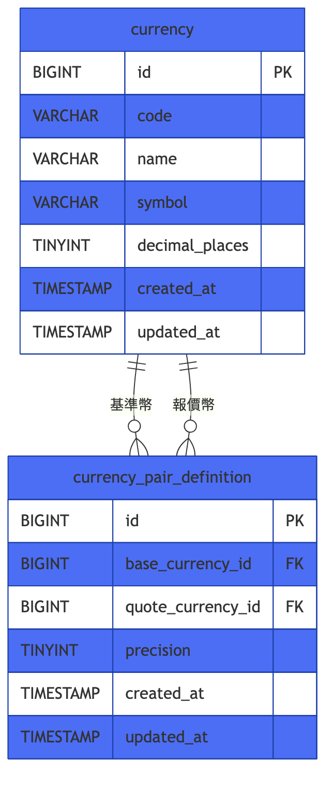

# 匯率中心幣種與品牌資料庫 ER 模型

本資料庫涵蓋匯率中心的三大主檔範疇：全系統共用、與品牌無關的幣種主檔資料（幣種本身與幣種對定義）、品牌主檔（品牌清單與其啟用狀態），以及品牌層級的幣種對設定（各品牌各自的啟用狀態與匯率型態）。整體拆分為三個以外鍵串接的功能群組：**幣種主檔**（currency 群組）、**品牌主檔**（brand 群組）、**品牌幣種對設定**（currency-pair 群組），其中 currency-pair 群組同時參照另外兩個群組，是兩個獨立主檔領域的交集資料。

## 全景

## currency

此群組涵蓋系統全域、與品牌無關的幣種主檔資料：幣種本身（currency）與幣種對定義（currency_pair_definition，僅代表「哪兩個幣種配成一對、精度多少」，不含啟用狀態）。

- **currency**：幣種主檔，紀錄系統支援的幣種（如 USD、JPY、TWD）；`code` 建立後不可變更，`name`/`symbol`/`decimal_places` 可修改。可透過 API 新增/查詢/修改/刪除，預設種子資料（USD/JPY/TWD/EUR/CNY）為一般資料列、無特殊保護。刪除防護：`currency_pair_definition.base_currency_id`/`quote_currency_id` 皆為 FK 指向 `currency.id`，且未標示 `ON DELETE CASCADE`，代表資料庫預設以 RESTRICT 擋下刪除——只要仍有 `currency_pair_definition` 以此幣種作為基準幣或報價幣，該幣種即無法被刪除。
- **currency_pair_definition**：全系統共用、與品牌無關的幣種對定義（如 USD/JPY 這一組配對），紀錄該幣種對的匯率儲存精度（`precision`）。`(base_currency_id, quote_currency_id)` 唯一，且兩者不可相同。**本表沒有 active 欄位**——啟用/停用完全下放到品牌層級的 `currency_pair`。刪除防護：業務規則要求（於應用層，非本表結構強制）刪除前必須先確認其名下所有 `currency_pair` 均已停用（`active = false`），確認後的實際 DB 刪除會透過 `currency_pair.currency_pair_definition_id` 的 `ON DELETE CASCADE` 連動刪除所有對應的 `currency_pair` 列。

## brand

此群組僅涵蓋品牌主檔本身（brand），作為所有品牌層級設定的擁有者根節點，獨立於幣種相關資料之外管理。

- **brand**：品牌主檔，內建七個品牌（au、moneta、pug、star、um、vjp、vt），各自可獨立開關（`active`）；`code`/`name` 於種子建立後不再變更，僅 `active` 會被修改。目前 spec 未提供刪除品牌的 API；`currency_pair.brand_id` FK 未標示 `ON DELETE CASCADE`，理論上若仍有 `currency_pair` 引用該品牌，資料庫層會以 RESTRICT 擋下刪除。

## currency-pair

此群組涵蓋品牌層級的幣種對設定（currency_pair），是「幣種對定義」與「品牌」兩個獨立主檔領域交集而生的設定資料，決定每個品牌對每個幣種對的啟用狀態與匯率型態。

- **currency_pair**：每個品牌對某一幣種對定義的個別設定——是否啟用（`active`，新建列預設 `false`）、匯率型態是自動或手動（`rate_type`）及對應的手動匯率值（`rate`）。每組 `(currency_pair_definition_id, brand_id)` 僅允許一筆（唯一鍵保護），幣種對定義新增時會自動為所有品牌各建立一筆。刪除防護／連動：`currency_pair_definition_id` 為 FK 且帶 `ON DELETE CASCADE`——只有在父層 `currency_pair_definition` 刪除前的應用層檢查（所有 `currency_pair` 皆已停用）通過後，才會觸發父層刪除並連動清除這些列；`brand_id` FK 無 CASCADE 設定，理論上會擋下品牌刪除（若仍有引用）。
