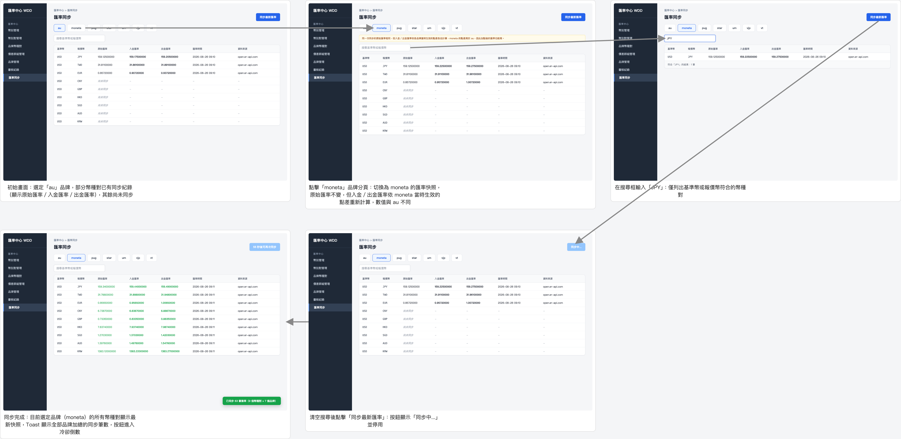

# 匯率同步

一鍵同步外部市場匯率、依品牌切換查看、並可依基準幣或報價幣搜尋的畫面：畫面上方為品牌分頁，切換品牌會顯示該品牌自己的原始匯率／入金匯率／出金匯率快照；入金／出金匯率是同步當下依各品牌「當時生效」的點差（沿用既有的品牌預設點差／點差群組機制）計算後凍結存檔，之後點差變更不會回頭改寫既有快照。同步一律涵蓋所有幣種對與所有品牌，60 秒內不能重複同步。

放大瀏覽：[瀏覽器開啟 (storyboard.html)](exchange-rate/storyboard.html) ・ [PDF](exchange-rate/storyboard.pdf)
