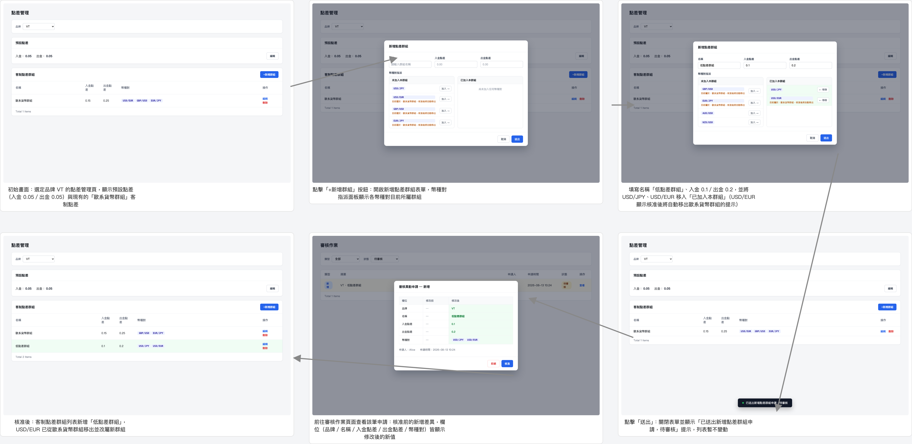

# 點差管理

這個分鏡圖走過在「點差管理」（`/spread-groups`）頁面中，為品牌 VT 新增一個客制點差群組（將 USD/JPY、USD/EUR 移入低點差群組）並送出審核，直到在審核作業頁面核准後生效的完整流程。

放大瀏覽：[瀏覽器開啟 (storyboard.html)](spread/storyboard.html) ・ [PDF](spread/storyboard.pdf)
